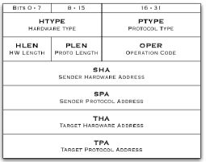
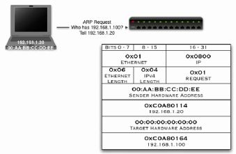
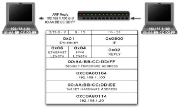

ARP
===

.. contents::

ARP conversation captured with tcpdump
--------------------------------------

::

        [root@masq-gw]# tcpdump -ennqti eth0 \( arp or icmp \)
        tcpdump: listening on eth0
        0:80:c8:f8:4a:51 ff:ff:ff:ff:ff:ff 42: arp who-has 192.168.99.254 tell 192.168.99.35         
        0:80:c8:f8:5c:73 0:80:c8:f8:4a:51 60: arp reply 192.168.99.254 is-at 0:80:c8:f8:5c:73        
        0:80:c8:f8:4a:51 0:80:c8:f8:5c:73 98: 192.168.99.35 > 192.168.99.254: icmp: echo request (DF)
        0:80:c8:f8:5c:73 0:80:c8:f8:4a:51 98: 192.168.99.254 > 192.168.99.35: icmp: echo reply      

Gratuitous ARP reply frames
---------------------------
where a machine announces its ownership of an IP address on a media segment. The arping utility can generate these gratuitous ARP frames. Linux kernels will respect gratuitous ARP frames

::

        [root@tristan]# arping -q -c 3 -A -I eth0 192.168.99.35
        [root@masq-gw]# tcpdump -c 3 -nni eth2 arp
        tcpdump: listening on eth2
        06:02:50.626330 arp reply 192.168.99.35 is-at 0:80:c8:f8:4a:51 (0:80:c8:f8:4a:51) 
        06:02:51.622727 arp reply 192.168.99.35 is-at 0:80:c8:f8:4a:51 (0:80:c8:f8:4a:51) 
        06:02:52.620954 arp reply 192.168.99.35 is-at 0:80:c8:f8:4a:51 (0:80:c8:f8:4a:51)

Unsolicited ARP request frames
------------------------------
Unsolicited ARP request frames, on the other hand, are broadcast ARP requests initiated by a host owning an IP address.

::

        [root@tristan]# arping -q -c 3 -U -I eth0 192.168.99.35
        [root@masq-gw]# tcpdump -c 3 -nni eth2 arp
        tcpdump: listening on eth2
        06:28:23.172068 arp who-has 192.168.99.35 (ff:ff:ff:ff:ff:ff) tell 192.168.99.35
        06:28:24.167290 arp who-has 192.168.99.35 (ff:ff:ff:ff:ff:ff) tell 192.168.99.35
        06:28:25.167250 arp who-has 192.168.99.35 (ff:ff:ff:ff:ff:ff) tell 192.168.99.35
        [root@masq-gw]# ip neigh show

ARP Cache
---------
An ARP cache is a stored mapping of IP addresses with link layer addresses. The ARP cache is also known as the neighbor table. As with many of the iproute2 tools, more information is available via ip neighbor than with arp.

::

        [root@tristan]# arp -na
        ? (192.168.99.7) at 00:80:C8:E8:1E:FC [ether] on eth0
        ? (192.168.99.254) at 00:80:C8:F8:5C:73 [ether] on eth0
        [root@tristan]# ip neighbor show
        192.168.99.7 dev eth0 lladdr 00:80:c8:e8:1e:fc nud reachable
        192.168.99.254 dev eth0 lladdr 00:80:c8:f8:5c:73 nud reachable

The only way to list permanently advertised entries in the neighbor table (proxy ARP entries) is with the arp.

Entries in the ARP cache are periodically and automatically verified unless continually used. Along with net/ipv4/neigh/$DEV/gc_stale_time, there are a number of other parameters in net/ipv4/neigh/$DEV which control the expiration of entries in the ARP cache. At gc_stale_time the state of the entry will change, reflecting the need to verify the reachability of the link layer address.

+-----------------------+------------------------------------------+-----------------------------+
| ARP cache entry state | meaning                                  | action if used              |
+=======================+==========================================+=============================+
| permanent             | never expires; never verified            | reset use counter           |
+-----------------------+------------------------------------------+-----------------------------+
| noarp                 | normal expiration; never verified        | reset use counter           |
+-----------------------+------------------------------------------+-----------------------------+
| reachable             | normal expiration                        | reset use counter           |
+-----------------------+------------------------------------------+-----------------------------+
| stale                 | still usable; needs verification         | reset use counter; change   |
|                       |                                          | state to delay              |
+-----------------------+------------------------------------------+-----------------------------+
| delay                 | schedule ARP request; needs verification | reset use counter           |
+-----------------------+------------------------------------------+-----------------------------+
| probe                 | sending ARP request                      | reset use counter           |
+-----------------------+------------------------------------------+-----------------------------+
| incomplete            | first ARP request sent                   | send ARP request            |
+-----------------------+------------------------------------------+-----------------------------+
| failed                | no response received                     | send ARP request            |
+-----------------------+------------------------------------------+-----------------------------+

The ARP Flux Problem
--------------------
When a linux box is connected to a network segment with multiple network cards, a potential problem with the link layer address to IP address mapping can occur. The machine may respond to ARP requests from both Ethernet interfaces. On the machine creating the ARP request, these multiple answers can cause confusion, or worse yet, non-deterministic population of the ARP cache. Known as ARP flux [13], this can lead to the possibly puzzling effect that an IP migrates non-deterministically through multiple link layer addresses. It's important to understand that ARP flux typically only affects hosts which have multiple physical connections to the same medium or broadcast domain.

::

        [root@real-client]# arping -I eth0 -c 3 10.10.20.67
        ARPING 10.10.20.67 from 10.10.20.33 eth0
        Unicast reply from 10.10.20.67 [00:80:C8:7E:71:D4]  11.298ms
        Unicast reply from 10.10.20.67 [00:80:C8:E8:1E:FC]  12.077ms
        Unicast reply from 10.10.20.67 [00:80:C8:E8:1E:FC]  1.542ms
        Unicast reply from 10.10.20.67 [00:80:C8:E8:1E:FC]  1.547ms
        Sent 3 probes (1 broadcast(s))
        Received 4 response(s)

To fix the problem, if all the interfaces on a different subnet

::

        sysctl -w net.ipv4.conf.all.arp_filter=1

A more effective solution is

::

        # when an arp request is received on any interface, only respond if 
        # that address is configured on that interface.
        echo 1 > /proc/sys/net/ipv4/conf/all/arp_ignore

        # when making an arp request sent through any device, always use an 
        # address that is configured on that device as the source address of
        # the arp request
        echo 2 > /proc/sys/net/ipv4/conf/all/arp_announce

Proxy ARP
---------
Proxy ARP is a technique for splitting an IP network into two separate segments. Hosts on one segment can only reach hosts in the other segment through the router performing proxy ARP.

::

        case "$1" in
        start)
                # -- create proxy arp settings according to
                #    table in the config file
                #
                grep -Ev '^#|^$' $CONFIG | {
                    while read INTERFACE IPADDR ; do
                        [ -z "$INTERFACE" -o -z "$IPADDR" ] && continue
                            arp -s $IPADDR -i $INTERFACE -D $INTERFACE pub
                            done
                }
                ;;
                stop)
                # -- clear the cache for any entries in the
                #    configuration file
                #
                grep -Ev '^#|^$' /etc/proxy-arp.conf | {
                    while read INTERFACE IPADDR ; do
                        [ -z "$INTERFACE" -o -z "$IPADDR" ] && continue
                            arp -d $IPADDR -i $INTERFACE
                            done
                }
                ;;
                status)
                arp -an | grep -i perm
                ;;
                restart)
                $0 stop
                $0 start
                ;;
                * )
                echo "Usage: proxy-arp {start|stop|restart}"
                exit 1
        esac

        exit 0
        #   
        # - end of proxy-arp

ARP Hacking
===========

.. contents:: 

ARP packet format
-----------------

ARP Request
-----------

ARP Reply
---------

ARP Attacks
-----------

ARP is unauthenticated
Whoever sends a reply to a requester first wins

#.   The ARP cache is updated with the contents of the reply
#.   Sometimes the ARP cache is updated when it gets a reply even if it didn't send a request (depends on OS)

This is exploited by sending forged REPLY packets to a victim to have them update their ARP cache

*   **Man in the middle** : Poison the victim with you MAC address for the IP address of the gateway, Host communicates with you instead of the gateway
*   **Denial of Service** : Poison the victim with a bogus MAC address and the IP address of the gateway, hosts can't communicate with the gateway
*   **Hub** : A network hub broadcasts all packets to all ports
*   **Switch** : A switch on the other hand maintains a record of whatever addresses are associated with each switch port in its CAM (Content-Addressable Memory)

CAM table overflow
------------------

#.   Attacker sends thousands of bogus MAC addresses to the networ
#.   Switch's CAM table is updated with each MAC
#.   The CAM table can only hold so much data, so at some point it becomes full
#.   The switch then forwards all traffic to al ports again (like a hub)

since switch now acts as a hub, the attacker can now eavesdrop ('sniff') all traffic on that segment

CAM table overflow requires many hundreds if not thousand of spoofed ARPs, very noisy and idenfitable attack. Cisco's port security limits the number of MAC addresses on each switch port. Once the limit is reached switch does not recognise any more MAC addresses on that port.

ARP Poisoning using ARP Request packets
---------------------------------------

Prior to responding to ARP Request packets, the host will update or 'add' the source protocol address (SPA) and source hardware address (SHA) to its cache. ( specified by RFC 826 )

Attacker sends ARP Request to host with the gateways ip address but with attackers MAC address and source addresses.

Using the ARP cache poisoning technique detailed above, if we poison the ARP cache of the victim with a NULL hardware address (00:00:00:00:00:00) for the destination (i.e network gateway). All frames from the victim to the gateway will be forwarded to all switch ports, allowing us to eavesdrop on that communication

Some OSs can be poisoned with their own MAC address for the destination

If a host receives an ARP request or reply with the same protocol address ( IP address ) as its own interface, but with a different hardware (MAC) address. Most Oss will warn the user that a duplicate IP address is in use on the network. Sending many packets like this to the victim could slow down OSs like windows.

