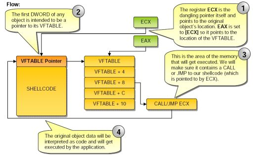

Dangling Pointer
================

.. contents::

Dangling Pointer
----------------

The most common result of this bug is the crash of the application or running thread. This is a nuisance, but not a code injection security threat. However, imagine if one could control the data that the dangling pointer points to. If that were possible, one could alter the behaviour of the application and even inject malicious code into it.

Objects that use virtual functions contain a pointer to their VFTABLE which is a table of pointers to the object's virtual functions. The VFTABLE pointer is always located in the first DWORD of the object's memory area. The VFTABLE is compiled into every instance of the class.

The basic priniciple of exploitation is overwriting the old object memory space with malicious data

In order to exploit the vulnerability, we will set the first DWORD of the malicious data to contain special address that will take the place of the object's VFTABLE. The rest of the memory will contain a shellcode that will be executed.

In order to use the exploit

#.   Find an address somewhere in the memory that holds the CALL/JMP ECX, which we will refer to it as the Call Address. Next we need to find a location somewhere in the memory that points to the Call Address.
#.   Change the VFTABLE pointer so that its value is (Pcall Address – OFFSET), which we'll call the Jumping Address
#.   Ensure that our new “VFTABLE pointer”, when interpreted as code, can be executed and doesn't significantly change the application flow and content of the registers. This is important because the CALL/JMP ECX is transferring the execution of the application to the start of our inserted buffer that holds the Jumping Address. 

We need to be able to overwrite the object's VFTABLE with our own value (after the object's de-allocation and before virutal function call). This means we need to find places where :

#.   The application allocates the exact amount of memory required for the malicious data
#.   The memory chunk's content is filled with user supplied data.
#.   The allocation must assign memory in the old object's heap, and not a different heap. 
