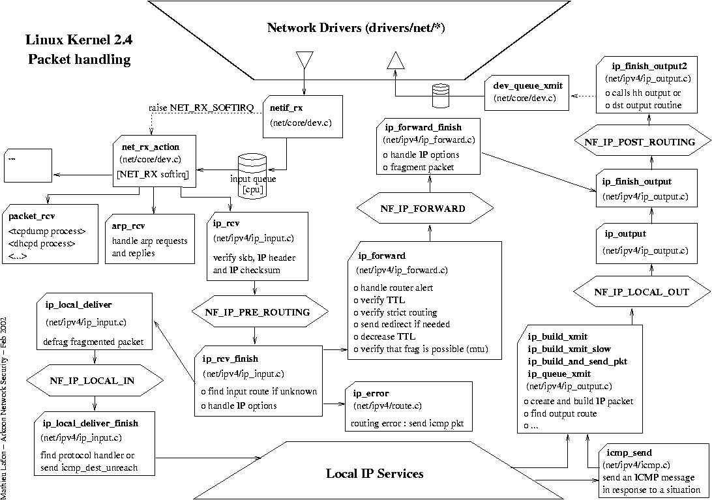

iptables
========

.. contents::

Packet Traversal for Non-Local Destination
------------------------------------------

*   All of the PREROUTING netfilter hooks are called here. This means that we get our first opportunity to inspect and drop a packet, we can perform DNAT on the packet to make sure that the destination IP is rewritten before we make a routing decision (at which time the destination address becomes very important). We can also set ToS or an fwmark on the packet at this time. If we want to use an IMQ device for ingress control, we can put our hooks here.
*   If we are using ipchains, the input chain is traversed.
*   Any traffic control on the real device on which the packet arrived is now performed.
*   The input routing stage is traversed by any packet entering the local machine. Here we concern ourselves only with packets which are routed through this machine to another destination Additionally, iproute2 NAT occurs here [36].
*   The packet enters the FORWARD netfilter hooks. Here, the packet can be mangled with ToS or fwmark. After the mangle chain is passed, the filter chain will be traversed. For kernel 2.4-based routing devices this will be the location for packet filtering rules. If we are using ipchains, the forward chain would be traversed here instead of the netfilter FORWARD hooks.
*   The output chain in an ipchains installation would be traversed here.
*   The POSTROUTING netfilter hooks are traversed. These include packet mangling, NAT and IMQ for egress.
*   Finally, the packet is transmitted via the outbound device per traffic control configuration on that outbound device. 

Packet Traversal for Local Destination
--------------------------------------

*   All of the PREROUTING netfilter hooks are called here. This means that we get our first opportunity to inspect and drop a packet, we can perform DNAT on the packet to make sure that the destination IP is rewritten before we make a routing decision (at which time the destination address becomes very important). We can also set ToS or an fwmark on the packet at this time. If we want to use an IMQ device for ingress control, we can put our hooks here.
*   If we are using ipchains, the input chain is traversed.
*   Any traffic control on the real device on which the packet arrived is now performed.
*   The input routing stage is traversed by any packet entering the local machine. Here we concern ourselves with packets bound for local destinations only.
*   The INPUT netfilter hooks are traversed. Commonly this is filtering for inbound connections, but can include packet mangling.
*   The local destination process receives the connection. If there is no open socket, an error is generated. 

Packet Traversal for Locally Generated
--------------------------------------

*   The process with the open socket sends data.
*   The routing decision is made. This is frequently called output routing because it is only for packets leaving the system. This routing code is (sometimes?) responsible for selecting the source IP of the outbound packet.
*   The netfilter OUTPUT hooks are traversed. The basic filter, nat, and mangle hooks are available. This is where SNAT can take place.
*   The output chain in an ipchains installation would be traversed here.
*   The POSTROUTING netfilter hooks are traversed. These include packet mangling, NAT and IMQ for egress.
*   Finally, the packet is transmitted via the outbound device per traffic control configuration on that outbound device. 

Multiple Outbound Internet links
--------------------------------

.. code-block:: sql
        :linenos:

        [root@masq-gw]# ip route show table main
        192.168.100.0/30 dev eth3  scope link
        67.17.28.0/28 dev eth4  scope link
        205.254.211.0/24 dev eth1  scope link
        192.168.100.0/24 dev eth0  scope link
        192.168.99.0/24 dev eth0  scope link
        192.168.98.0/24 via 192.168.99.1 dev eth0
        10.38.0.0/16 via 192.168.100.1 dev eth3
        127.0.0.0/8 dev lo  scope link 
        default via 205.254.211.254 dev eth1

        [root@masq-gw]# ip route flush table 4
        [root@masq-gw]# ip route show table main | grep -Ev ^default  | while read ROUTE ; do  ip route add table 4 $ROUTE ; done
        [root@masq-gw]# ip route add table 4 default via 67.17.28.14
        [root@masq-gw]# ip route show table 4
        192.168.100.0/30 dev eth3  scope link
        67.17.28.0/28 dev eth4  scope link
        205.254.211.0/24 dev eth1  scope link
        192.168.100.0/24 dev eth0  scope link
        192.168.99.0/24 dev eth0  scope link
        192.168.98.0/24 via 192.168.99.1 dev eth0
        10.38.0.0/16 via 192.168.100.1 dev eth3
        127.0.0.0/8 dev lo  scope link 
        default via 67.17.28.14 dev eth4

.. code-block:: sql
        :linenos:

        [root@masq-gw]# iptables -t mangle -A PREROUTING -p tcp --dport 80 -s 192.168.99.0/24 -j MARK --set-mark 4
        [root@masq-gw]# iptables -t mangle -A PREROUTING -p tcp --dport 443 -s 192.168.99.0/24 -j MARK --set-mark 4
        [root@masq-gw]# iptables -t mangle -nvL
        Chain PREROUTING (policy ACCEPT 0 packets, 0 bytes)
         pkts bytes target     prot opt in     out     source                destination         
            0     0 MARK       tcp  --  *      *       192.168.99.0/24       0.0.0.0/0          tcp dpt:80 MARK set 0x4 
            0     0 MARK       tcp  --  *      *       192.168.99.0/24       0.0.0.0/0          tcp dpt:443 MARK set 0x4 

        Chain OUTPUT (policy ACCEPT 0 packets, 0 bytes)
          pkts bytes target     prot opt in     out     source               destination
        [root@masq-gw]# iptables -t nat -A POSTROUTING -o eth4 -j SNAT --to-source 67.17.28.12
        [root@masq-gw]# iptables -t nat -A POSTROUTING -o eth1 -j SNAT --to-source 205.254.211.179
        Chain PREROUTING (policy ACCEPT 0 packets, 0 bytes)
         pkts bytes target     prot opt in     out     source               destination         

        Chain POSTROUTING (policy ACCEPT 0 packets, 0 bytes)
         pkts bytes target     prot opt in     out     source               destination         
            0     0 SNAT       all  --  *      eth4    0.0.0.0/0            0.0.0.0/0          to:67.17.28.12
            0     0 SNAT       all  --  *      eth1    0.0.0.0/0            0.0.0.0/0          to:205.254.211.179

        Chain OUTPUT (policy ACCEPT 0 packets, 0 bytes)
         pkts bytes target     prot opt in     out     source               destination

.. code-block:: sql
        :linenos:

        [root@masq-gw]# ip rule add fwmark 4 table 4
        [root@masq-gw]# ip rule show
        0:      from all lookup local 
        32765:  from all fwmark        4 lookup 4 
        32766:  from all lookup main 
        32767:  from all lookup 253
        [root@masq-gw]# ip route flush cache

With these iptables lines we have instructed netfilter to mark packets matching these criteria with the fwmark and we have prepared the NAT rules so that our outbound packets will originate from the correct IPs.

Once again, it is important to realize that the fwmark added to a packet is only valid and discernible while the packet is still on the host running the packet filter. The fwmark is stored in a data structure the kernel uses to track the packet. Because the fwmark is not a part of the packet itself, the fwmark is lost as soon as the packet has left the local machine.

iproute2 supports the use of fwmark as a selector for rule lookups, so we can use fwmarks in the routing policy database to cause packets to be conditionally routed based on that fwmark. This can lead to great complexity if a machine has multiple routing tables, packet filters, and other fancy networking tools, such as NAT or proxies. Caveat emptor.

A convention is to use the same number for a routing table and fwmark where possible. This simplifies the maintenance of the systems which are using iproute2 and fwmark, especially if the table identifier and fwmark are set in a configuration file with the same variable name. Since we are testing this on the command line, we'll just make sure that we can add the rules first.

Tracking a Packet
-----------------

Ensure that **ipt_LOG** and **syslog-ng** modules are loaded

To trace all packets to port 80

::

        iptables -t raw -A PREROUTING -p tcp --dport 80 -j TRACE
        iptables -t raw -A OUTPUT -p tcp --dport 80 -j TRACE

Logs should end up in */var/log/message* or */var/log/firewall* depending upon syslog-ng configuration

To just a packet which satisfies a rule, use **-j LOG**, valid in *nat* and *filter* chains

::

        -j LOG --log-prefix "rule description"

