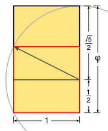

Math : Fibonnaci
================

.. contents::

fibonnaci
---------
1 1 2 3 5 8 13 21

fibonnaci in nature
-------------------
sprials on any fruit or flowers are fibonnaci numbers
Any number can be expressed as a sum of fibonnaci numbers without any repititions
45 = 34 + 8 + 3

fibonnaci with different seeds
------------------------------
2 1 3 4 7 11 18 29 ...

Generating fibonnaci number
---------------------------
4th + 5th = 6th
2*5th - 3th = 6th
5th*5th (+ or -) 1 = 4th * 6th

Golden Ratio
------------
Ratio of 2 consecutive fibonnaci numbers converges to 1.61803 as a fraction 1 + sqrl(5) whole divide / 2. Derived using x = 1 + (1 / (1+x)).

No matter what the starting seeds the ratio also converges to golden ratio

Golden Rectangle
----------------
Golden rectangle's ratio of length/breadth is the golden ratio. To draw a golden rectangle take a square extend its a base. Take the midpoint of the base and draw an arc with the length of the midpoint to the top corner and cut the base at that distance. If we extend the square to this point to form a rectangle it is an golden rectangle.

If we consider the side of square as 2x. The triangle formed with midpoint and vertical side is right triangle with base x and height 2x. The hypotenuse is x*sqrt(5), which is the length of the arc that we have drawn. Now when we extend this square to a rectangle the base becomes x + x*sqrt(5). The ratio comes down as the golden ratio. And this triangle is also called golden triangle

Golden Triangle
---------------
Right-angled triangle with height twice of base. 5 pieces of golden triangle can be used to a larger golden triangle with base sqrt(5) times the original base. This is only triangle which has this property. Ordinary triangles can be created with 4 pieces of similar triangles.

Generating a spiral from Golden Rectangles
------------------------------------------
Take a golden rectangle, cut a square out of the rectangle with the side of height. This would again result in another rectangle. If the original rectangle base is (sqrt(5) + 1), and height 2. When we cut a square of side 2. we end with base of sqrt(5) + 1 - 2 = sqrt(5) -1 and base 2. This when we multiply with sqrt(5) + 1 on both numeritor and denominator we would endup with golden ratio. This is the only rectangle which has this property of being able to generate similar rectangle when a square is cut from it.

When the try to goin corners of these rectangles with a smooth arc we generate a spiral.

