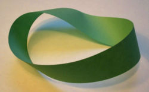

Moebius Band
============

Moebuis Band is a surface with only one side and only one boundary component. It has the mathematical property of being non-orientable. It is also a ruled surface. It was discovered independently by the German mathematicians August Ferdinand Möbius and Johann Benedict Listing in 1858.

A model can easily be created by taking a paper strip and giving it a half-twist, and then joining the ends of the strip together to form a single strip. In Euclidean space there are in fact two types of Moebius strips depending on the direction of the half-twist: clockwise and counterclockwise. The Moebius strip is therefore chiral, which is to say that it has handedness (as in right-handed or left-handed).

It is straightforward to find algebraic equations the solutions of which have the topology of a Möbius strip, but in general these equations do not describe the same geometric shape that one gets from the twisted paper model described above. In particular, the twisted paper model is a developable surface (it has zero Gaussian curvature). A system of differential-algebraic equations that describes models of this type was published in 2007 together with its numerical solution.

The Euler characteristic of the Moebius strip is zero.

