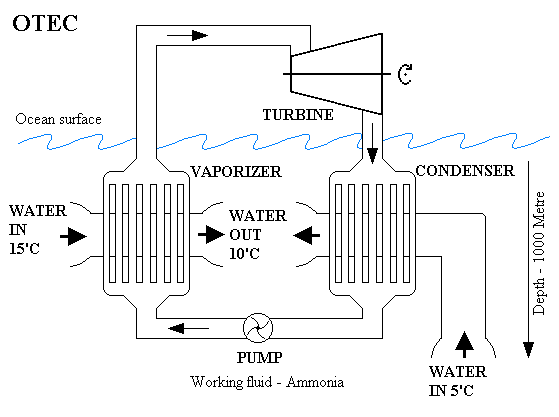

Science : Ocean Energy
======================

.. contents::

ocean energy
------------
Ocean thermal energy conversion (OTEC) is a method for generating electricity which uses the temperature difference that exists between deep and shallow waters to run a heat engine. As with any heat engine, the greatest efficiency and power is produced with the largest temperature difference.

The temperature difference generally increases with decreasing latitude, i.e. near the equator, in the tropics. However, evaporation prevents the surface temperature from exceeding 27 deg.C (80 deg.F). Also the subsurface water rarely falls below 5 deg.C

The total energy available is one or two orders of magnitude higher than other ocean energy options such as wave power, but the small magnitude of the temperature difference makes energy extraction comparatively difficult and expensive, due to low thermal efficiency. Earlier OTEC systems had an overall efficiency of only 1 to 3% (the theoretical maximum efficiency lies between 6 and 7%.

A heat engine is a thermodynamic device placed between a high temperature reservoir and a low temperature reservoir. As heat flows from one to the other, the engine converts some of the heat energy to work energy. This principle is used in steam turbines and internal combustion engines, while refrigerators reverse the direction of flow of both the heat and work energy. Rather than using heat energy from the burning of fuel, OTEC power draws on temperature differences caused by the sun's warming of the ocean surface.

OTEC could produce gigawatts of electrical power. Managing costs is still a huge challenge, however. All OTEC plants require an expensive, large diameter intake pipe, which is submerged a kilometre or more into the ocean's depths, to bring very cold water to the surface.

To operate, the cold seawater must be brought to the surface. This can be accomplished through direct pumping. A second method is to desalinate the seawater near the sea floor; this lowers its density, which will cause it to "float" up through a pipe to the surface.

Depending on the location

*    Land based plant
*    Shelf based plant
*    Floating plant

Depending on the cycle used

*    Open cycle
*    Closed cycle
*    Hybrid cycle

Closed-cycle
------------
Closed-cycle systems use fluid with a low boiling point, such as ammonia, to rotate a turbine to generate electricity. Warm surface seawater is pumped through a heat exchanger where the low-boiling-point fluid is vaporized. The expanding vapor turns the turbo-generator. Then, cold, deep seawater—pumped through a second heat exchanger—condenses the vapor back into a liquid, which is then recycled through the system.

Open-cycle
----------
Open-cycle OTEC uses the tropical oceans' warm surface water to make electricity. When warm seawater is placed in a low-pressure container, it boils. The expanding steam drives a low-pressure turbine attached to an electrical generator. The steam, which has left its salt and contaminants behind in the low-pressure container, is pure fresh water. It is condensed back into a liquid by exposure to cold temperatures from deep-ocean water. This method has the advantage of producing desalinized fresh water, suitable for drinking water or irrigation.

Hybrid
------
A hybrid cycle combines the features of both the closed-cycle and open-cycle systems. In a hybrid OTEC system, warm seawater enters a vacuum chamber where it is flash-evaporated into steam, similar to the open-cycle evaporation process. The steam vaporizes the ammonia working fluid of a closed-cycle loop on the other side of an ammonia vaporizer. The vaporized fluid then drives a turbine to produce electricity. The steam condenses within the heat exchanger and provides desalinated water. 
