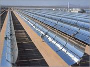
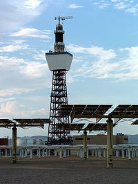
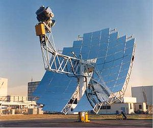
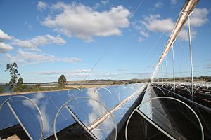

Science : Solar Energy
======================

.. contents::

Solar energy
------------
Solar energy is the light and radiant heat from the Sun that influences Earth's climate and weather and sustains life. Solar power is sometimes used as a synonym for solar energy or more specifically to refer to electricity generated from solar radiation.

Solar energy technologies can provide electrical generation by heat engine or photovoltaic means, space heating and cooling in active and passive solar buildings; potable water via distillation and disinfection, daylighting, hot water, thermal energy for cooking, and high temperature process heat for industrial purposes.

The Earth receives 174 petawatts (PW) of incoming solar radiation (insolation) at the upper atmosphere.[1] Approximately 30% is reflected back to space while the rest is absorbed by clouds, oceans and land masses. The spectrum of solar light at the Earth's surface is mostly spread across the visible and near-infrared ranges with a small part in the near-ultraviolet.

Solar technologies are broadly characterized as either passive or active depending on the way they capture, convert and distribute sunlight. Active solar techniques use photovoltaic panels, pumps, and fans to convert sunlight into useful outputs. Passive solar techniques include selecting materials with favorable thermal properties, designing spaces that naturally circulate air, and referencing the position of a building to the Sun.

Active solar technologies increase the supply of energy and are considered supply side technologies, while passive solar technologies reduce the need for alternate resources and are generally considered demand side technologies.

Electrical Generation
---------------------
Sunlight can be converted into electricity using photovoltaics (PV), concentrating solar power (CSP), and various experimental technologies. PV has mainly been used to power small and medium-sized applications, from the calculator powered by a single solar cell to off-grid homes powered by a photovoltaic array.

For large-scale generation, CSP plants are used.

Light Tube
----------
Light tubes or light pipes are used for transporting or distributing natural or artificial light. In their application to daylighting, they are also often called sun pipes, solar pipes, solar light pipes, or daylight pipes.

Generally speaking, a light pipe or light tube may refer to:

*    a tube or pipe for transport of light to another location, minimizing the loss of light;
*    a transparent tube or pipe for distribution of light over its length, either for equidistribution along the entire length (see also sulfur lamp) or for controlled light leakage.

High-temperature collectors
---------------------------
Where temperatures below about 95°C are sufficient, as for space heating, flat-plate collectors of the nonconcentrating type are generally used. The fluid-filled pipes can reach temperatures of 150 to 220 degrees Celsius when the fluid is not circulating. This temperature is too low for efficient conversion to electricity.

The efficiency of heat engines increases with the temperature of the heat source. To achieve this in solar thermal energy plants, solar radiation is concentrated by mirrors or lenses to obtain higher temperatures — a technique called Concentrated Solar Power (CSP). The practical effect of high efficiencies is to reduce the plant's collector size and total land use per unit power generated, reducing the environmental impacts of a power plant as well as its expense.

As the temperature increases, different forms of conversion become practical. Up to 600°C, steam turbines, standard technology, have an efficiency up to 41%. Above this, gas turbines can be more efficient. Higher temperatures are problematic because different materials and techniques are needed.

Since the CSP plant generates heat first of all, it can store the heat before conversion to electricity. With current technology, storage of heat is much cheaper and more efficient than storage of electricity. In this way, the CSP plant can produce electricity day and night. If the CSP site has predictable solar radiation, then the CSP plant becomes a reliable power plant.

System designs
--------------
During the day the sun has different positions. If the mirrors or lenses do not move, then the focus of the mirrors or lenses changes. Therefore it seems unavoidable that there needs to be a tracking system that follows the position of the sun (for solar photovoltaics a solar tracker is only optional). The tracking system increases the cost and complexity. With this in mind, different designs can be distinguished in how they concentrate the light and track the position of the sun.

Parabolic trough designs
------------------------
Parabolic trough power plants use a curved trough which reflects the direct solar radiation onto a receiver (also called absorber or collector) running along the trough, above the reflectors. The trough is parabolic in one direction and just straight in the other direction. For change of position of the sun orthogonal to the receiver, the whole trough tilts so that direct radiation remains focused on the receiver. However, a change of position of the sun parallel to the trough, does not require adjustment of the mirrors, since the light is just concentrated on another part of the receiver. So, the trough design avoids a second axis for tracking.

A substance (also called heat transfer fluid) passes through the receiver and becomes hot. Used substances are synthetic oil, molten salt and pressurized steam. The receiver can be in a vacuum chamber of glass. The light will shine through the glass and vacuum, but the vacuum will significantly reduce convective loss of the collected heat. The substance with the heat is transported to a heat engine where about a third of the heat is converted to electricity.

Tracking the sun from East to West by rotation on one axis, the high precision reflector panels concentrate the solar radiation coming directly from the sun onto an absorber pipe located along the focal line of the collector.

Power tower designs
-------------------
Power towers (also known as 'central tower' power plants or 'heliostat' power plants) use an array of flat, moveable mirrors (called heliostats) to focus the sun's rays upon a collector tower (the receiver).

The advantage of this design above the parabolic trough design is the higher temperature. Thermal energy at higher temperatures can be converted to electricity more efficiently and can be more cheaply stored for later use. Furthermore, there is less need to flatten the ground area. In principle a power tower can be built on a hillside. Mirrors can be flat and plumbing is concentrated in the tower. The disadvantage is that each mirror must have its own dual-axis control, while in the parabolic trough design one axis can be shared for a large array of mirrors.

Dish designs
------------
A dish system uses a large, reflective, parabolic dish (similar in shape to satellite television dish). It focuses all the sunlight that strikes the dish up onto to a single point above the dish, where a receiver captures the heat and transforms it into a useful form.

Advantage of a dish system is that it can achieve much higher temperatures due to the higher concentration of light (as in tower designs). Higher temperatures leads to better conversion to electricity and the dish system is very efficient on this point. However, there are also some disadvantages. Heat to electricity conversion requires moving parts and that results in maintenance. In general, a centralized approach for this conversion is better than the dencentralized concept in the dish design. Second, the (heavy) engine is part of the moving structure, which requires a rigid frame and strong tracking system. Furthermore, parabolic mirrors are used instead of flat mirrors and tracking must be dual-axis.

Frensel reflectors
------------------
A linear Fresnel reflector power plant uses a series of long, narrow, shallow-curvature (or even flat) mirrors to focus light onto one or more linear receivers positioned above the mirrors. On top of the receiver a small parabolic mirror can be attached for further focusing the light. These systems aim to offer lower overall costs by sharing a receiver between several mirrors (as compared with trough and dish concepts), while still using the simple line-focus geometry with one axis for tracking.

This is similar to the trough design (and different from central towers and dishes with dual-axis). The receiver is stationary and so fluid couplings are not required (as in troughs and dishes). The mirrors also do not need to support the receiver, so they are structurally simpler. When suitable aiming strategies are used (mirrors aimed at different receivers at different times of day), this can allow a denser packing of mirrors on available land area.

Heat Exchange
-------------
Heat in a solar thermal system is guided by five basic principles:

*    heat gain
*    heat transfer
*    heat storage
*    heat transport
*    heat insulation.

Heat gain is the heat accumulated from the sun in the system. Solar thermal heat is trapped using the greenhouse effect; the greenhouse effect in this case is the ability of a reflective surface to transmit short wave radiation and reflect long wave radiation. Heat and infrared radiation (IR) are produced when short wave radiation light hits the absorber plate, which is then trapped inside the collector. Fluid, usually water, in the absorber tubes collect the trapped heat and transfer it to a heat storage vault.

Heat is transferred either by conduction or convection. When water is heated, kinetic energy is transferred by conduction to water molecules throughout the medium. These molecules spread their thermal energy by conduction and occupy more space than the cold slow moving molecules above them. The distribution of energy from the rising hot water to the sinking cold water contributes to the convection process. Heat is transferred from the absorber plates of the collector in the fluid by conduction.

Heat is transferred to a thermal storage medium in an insulated reservoir during hours with sunlight, and is withdrawn for power generation during hours lacking sunlight. Rate of heat transfer is related to the conductive and convection medium as well as the temperature differences. Bodies with large temperature differences transfer heat faster than bodies with lower temperature differences.

Heat storage allows a solar thermal plant to produce electricity at night and on overcast days. Heat is transferred to a thermal storage medium in an insulated reservoir during the day, and withdrawn for power generation at night. Thermal storage media include pressurized steam, concrete, a variety of phase change materials, and molten salts such as sodium and potassium nitrate.

A variety of fluids have been tested to transport the sun's heat, including water, air, oil, and sodium, but molten salt was selected as best. Molten salt is used in solar power tower systems because it is liquid at atmosphere pressure, it provides an efficient, low-cost medium in which to store thermal energy, its operating temperatures are compatible with today's high-pressure and high-temperature steam turbines, and it is non-flammable and nontoxic. In addition, molten salt is used in the chemical and metals industries as a heat-transport fluid, so experience with molten-salt systems exists for non-solar.

The molten salt is a mixture of 60 percent sodium nitrate and 40 percent potassium nitrate, commonly called saltpeter. The salt melts at 430 °F (220 °C) and is kept liquid at 550 °F (290 °C) in an insulated cold storage tank. The uniqueness of this solar system is in de-coupling the collection of solar energy from producing power, electricity can be generated in periods of inclement weather or even at night using the stored thermal energy in the hot salt tank. Normally tanks are well insulated and can store energy for up to a week. 
