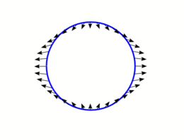

Science : Tidal Energy
======================

.. contents::

Tidal energy
------------
Tidal power, sometimes called tidal energy, is a form of hydropower that converts the energy of tides into electricity or other useful forms of power. Although not yet widely used, tidal power has potential for future electricity generation. Tides are more predictable than wind energy and solar power.

Tidal Force
-----------
The tidal force is a secondary effect of the force of gravity and is responsible for the tides. It arises because the gravitational acceleration experienced by a large body is not constant across its diameter. One side of the body has greater acceleration than its center of mass, and the other side of the body has lesser acceleration.

When a body (body 1) is acted on by the gravity of another body (body 2), the field can vary significantly on body 1 between the side of the body facing body 2 and the side facing away from body 2. Figure 2 shows the differential force of gravity on a spherical body (body 1) exerted by another body (body 2). These so called tidal forces cause strains on both bodies and may distort them or even, in extreme cases, break one or the other apart.

In above figure, the Moon's (or Sun's) gravity differential field at the surface of the earth is known as the Tide Generating Force. This is the primary mechanism that drives tidal action and explains two tidal equipotential bulges, accounting for two high tides per day.

In the case of an elastic sphere, the effect of a tidal force is to distort the shape of the body without any change in volume. The sphere becomes an ellipsoid, with two bulges, pointing towards and away from the other body. An elliptical distortion is approximately what happens to the Earth's oceans under the action of the Moon. The Earth and Moon rotate about their common center of mass or barycenter, and their gravitational attraction provides the centripetal force necessary to maintain this motion. To an observer on the Earth, very close to this barycenter, the situation is one of the Earth as body 1 acted upon by the gravity of the Moon as body 2. All parts of the Earth are subject to the Moon's gravitational forces, causing the water in the oceans to redistribute, forming bulges on the sides near the Moon and far from the Moon.

Tidal power is the only form of energy which derives directly from the relative motions of the Earth-Moon system, and to a lesser extent from the Earth-Sun system.

Tidal movement causes a continual loss of mechanical energy in the Earth-Moon system due to pumping of water through the natural restrictions around coastlines, and due to viscous dissipation at the seabed and in turbulence. This loss of energy has caused the rotation of the Earth to slow in the 4.5 billion years since formation. During the last 620 million years the period of rotation has increased from 21.9 hours to the 24 hours we see now; in this period the Earth has lost 17% of its rotational energy. Tidal power may take additional energy from the system, increasing the rate of slowing over the next millions of years.

Tidal power can be classified into two main types:

*    Tidal stream systems make use of the kinetic energy of moving water to power turbines, in a similar way to windmills that use moving air. This method is gaining in popularity because of the lower cost and lower ecological impact compared to barrages.
*    Barrages make use of the potential energy in the difference in height (or head) between high and low tides. Barrages suffer from very high civil infrastructure costs, a worldwide shortage of viable sites, and environmental issues.

