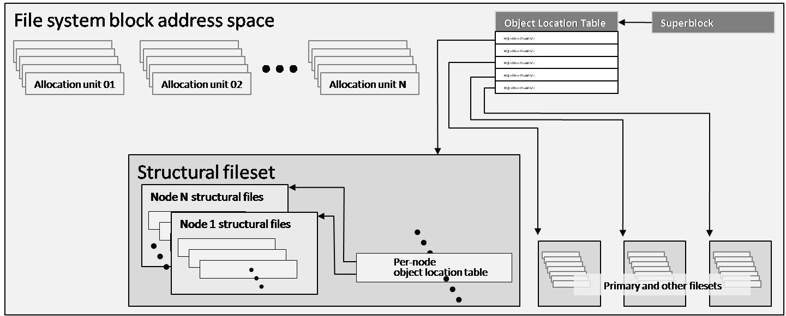

Symatnec : CFS
==============

.. contents::

Introduction
------------

*    journaling, extent-based filesystem
*    64-bit fully POSIX-compliant cluster file system
*    FS upto 256 TB of storage
*    1 billion files
*    32 nodes
*    individual sparse files as large as 8 exabytes
*    VCS uses coordinator disks to resolve cluster partitions that result from failures of the private network. (Alternatively, a coordinator server can be configured in place of one or more of the disks.) In addition, if CFS file systems reside on volumes configured from PGR-capable disks, CVM uses data disk fencing to protect against data corruption when a cluster partitions
*    Named data streams make it possible for applications to attach virtually unlimited custom metadata to files. Structured as hidden files, named data streams can contain anything from a single byte to a video clip.
*    Portable Data Containers (PDC). Storage Foundation Portable Data Container (PDC) technology makes cross-platform data sharing possible.

Coordinator disks do not store data, so small-(10 megabyte or greater) LUNs are the most suitable candidates. The VCS fencing algorithm requires that a cluster have three or some larger odd number of coordinators, and that coordinators always be accessed in the same order.
When a cluster node determines (by the absence of heartbeat messages) that it cannot communicate with one or more other nodes, it first blocks I/O to shared file systems to protect against data corruption. It then requests exclusive access to the first coordinator (using the PGR protocol if the coordinator is a disk). All nodes in a partitioned cluster do this at approximately the same time.
The SCSI-3 Persistent Group Reservation protocol and the VCS protocol for coordination point servers only permit one node to successfully reserve the first coordinator; all other nodes’ requests fail because the coordinator is already reserved. A node’s subsequent behavior depends upon its success in reserving the first coordinator:
*   Successful node. The successful node immediately requests reservations for the other two coordinators
*   Other nodes. Nodes that failed to reserve the first coordinator voluntarily wait for a short period before requesting reservations on the other coordinators

Once a node succeeds in reserving more than half of the coordinators, it and the nodes with which it can communicate on the private network perform a cluster reconfiguration resulting in a cluster that does not include nodes with which they cannot communicate. The nodes of the reconfigured cluster complete failover by performing the following actions:
*   Revoke partitioned nodes’ access to data disks. The new cluster’s CVM master commands all PGR-capable data disks in CVM shared disk groups to revoke the registrations of partitioned nodes so that commands from them are no longer honored. This is called data disk fencing. Data disk fencing greatly diminishes the potential for a cluster partition to result in data corruption, and is therefore highly recommended

VCS forces partitioned nodes that fail to reserve a majority of the coordinators to shut down abruptly (“panic”).

For PGR-capable shared data disks, the CVM Master sets their PGR keys to reserve them for exclusive use by cluster members (“fences” them). When a cluster reconfigures, CVM removes the keys for the departed members to avoid the potential for data corruption in case removed nodes behave improperly (e.g., by attempting to flush data). Without the PGR capability, there is a remote but real possibility that badly-behaved applications in nodes removed from the cluster could corrupt data by continuing to access disks after reconfiguration.

*   Oracle Disk Manager (ODM). Administrative hint 1 Oracle Corporation publishes a specification for an Oracle Disk Systems that use CFS Quick I/O files for Manager (ODM) API that its Oracle database storage should be database management system products use to optimize I/O upgraded to the Oracle Disk Manager operations. Perhaps the most library, to improve integration with important function of ODM is Oracle current and future releases. asynchronous file I/O between Oracle’s own buffers and the disks on which the files resides. CFS includes an ODM library that uses CFS and CVM capabilities to implement the functionality expressed in the ODM APIs
*   Quick I/O: The Quick I/O for databases feature is the functionally similar    precursor of CFS’ ODM library implementation. Still supported by CFS on enterprise UNIX platforms, Quick I/O provides advantages similar to ODM’s  for any database management system (or other application) that synchronizes its own I/O requests and coordinates buffer usage internally
*   Concurrent I/O: For database management systems and other applications that do not include their own APIs for storage access, CFS includes the  Concurrent I/O (CIO) feature that makes it possible for any application to  perform asynchronous file I/O directly between its own buffers and the disks on which the files reside. Administrators can specify concurrent I/O as a mount option, applying it to all files in a file system. Alternatively, application developers can declare cio as a cache advisory for specific files

The CFS database I/O acceleration mechanisms enhance database management system I/O performance in three ways:
*   Asynchronous I/O. CFS database I/O accelerators make it possible for data- base management system execution threads to issue I/O requests and continue executing without waiting for I/O to complete. When a thread requires the result of its I/O request, or when it has exhausted its work queue, it waits for the I/O to complete
*   Direct I/O. CFS database I/O accelerators schedule data transfers directly between database manager buffers and disk storage. They do not copy data between database manager buffers and operating system page cache as CFS would for normal application I/O requests
*   Write lock avoidance. CFS database I/O accelerators bypass the operating system’s normal file write locking mechanisms. This increases parallel execu-tion by allowing concurrent requests to be  issued to CVM and thence to the hardware I/O driver level

Each CFS instance maintains an FCL for each mounted file system in which it records changes that it makes. Periodically, the primary CFS instance merges all instances into a master FCL in which all  records, even those from different nodes that refer to the same object are recorded in proper sequence.

The CFS file system history log is intended for the use of Symantec and partner support engineers, so no user-accessible utilities for it are included in CFS products. Having a file system history log leads to faster problem diagnosis and resolution by giving support engineers instant access to reliable, up-to-date information about the state of a file system and how it got that way.

CFS stores externally-visible user and group quota limit and current consumption information in separate files in the root directory of a file system’s primary fileset. In addition, per-node structural files maintain information about current space and inode (file) consumption that CFS updates as changes occur. CFS periodically reconciles all nodes’ consumption information into a master quota structural file, and reconciles internal and external resource consumption data whenever quota control is enabled or disabled.

An administrator can use the setext console command to pre-allocate space for an ordinary file. If Quick I/O (page 36) is enabled, the qiomkfile command can also be used to create Quick I/O files with pre-allocated space.

An administrator can use the fsmap console command to locate the “holes” in the file block address space of a sparse file.

CFS itself makes use of the sparse file concept to simplify the indexing of user and group quota files in file system structural file sets. For example, there are four billion possible unique user IDs and group IDs in a UNIX system. Obviously, no file systems even approach that number of actual users or groups. CFS computes a record number for each user or group for which a quota is assigned by multiplying the user or group ID by the size of a quota file record to give an offset into the respective quota file block address space. When it writes a user or group quota file record for the first time, CFS allocates storage space and creates an extent at whatever file block offset is indicated by the write request. Users and groups to which no quotas have been assigned remain as holes in the file
block address space.

A CFS file system, on the other hand, can occupy as many as 8,192 CVM volumes. The volumes occupied by a CFS file system are called its volume set, or VSET. An administrator organizes each file system’s VSET into storage tiers by assigning tags to them. Identically tagged volumes in a file system’s VSET form a storage tier.

Whatever the reason for a volume state change, all nodes in the cluster must perceive the change at the same logical instant. When a CVM Master detects or is informed by a slave that a volume’s state has changed, it initiates a cluster-wide transaction to process the change. It stores the new volume state persistently in the private regions of the disks that contain the disk group’s CVM metadata, marked as a pending change. It then communicates the pending change to slave instances, causing them to initiate a coordinated volume state change transaction. All instances block further I/O to the affected volumes and allow outstanding I/O operations to complete. When all I/O is complete, the Master completes the transaction, making the pending state change the current
volume state. Once the transaction is complete, all instances resume I/O to the disk group, adjusting their I/O algorithms as required. For example, during a cluster reconfiguration that follows a node failure, CVM puts mirrored volumes into a read-writeback mode in which every client read is satisfied by reading data from one mirror and writing it to corresponding blocks of all other mirrors. This ensures that the same data is returned, no matter which mirror is used to satisfy a client read request. CVM volumes can be configured with dirty region logs (DRLs) that keep track of outstanding writes so that during recovery, only block regions flagged as potentially at risk need to be copied in read-writeback mode. For volumes configured without DRLs, a CVM background thread traverses the entire block spaces in read-writeback mode. CVM distributes responsibility for recovering mirrored volumes after a node failure among the remaining cluster nodes on a volume-by-volume basis. If the cluster node on which a CVM Master instance is running fails, the cluster reconfigures. As part of the reconfiguration, a new CVM Master instance is selected and volume states are adjusted as described above. Any IO that requires      Master involvement is delayed until the new master has been selected.

When using SmartMove to copy the contents of one volume to another, CVM queries CFS to determine which volume blocks are in use, and copies only those blocks. SmartMove obviously saves time
whenever data is copied between volumes, but is particularly advantageous when the “disks” underlying the target volume are LUNs in a disk array that supports thin provisioning. Because CVM only writes actual data, the disk array only allocates space for actual data; no physical storage is allocated for unusef file system blocks.

*   Asynchronous I/O. Database manager execution threads are able to issue I/O requests and continue executing without waiting for them to complete
*   Direct I/O. Database manager I/O requests cause data to be transferred directly to and from its own buffers. When a database manager accelerator is active, CFS does not copy data to or from operating system page cache on its way between database manager and disk storage
*   Write lock avoidance. Database management system write requests bypass operating systems’ file write locking mechanisms, allowing the operating system to pass multiple write requests to a single file through to the I/O stack in parallel

The CFS data caching and file I/O serialization protections are unnecessary with database managers, because they themselves guarantee that they do not issue potentially conflicting I/O commands concurrently, or reuse buffers before I/O is complete.

CFS database accelerators are cluster-aware. Their instances communicate with each other to maintain the structural integrity of database container files and to keep administration simple.

*   File descriptor virtualization. The CFS ODM library saves memory by mapping Oracle’s file descriptors to file handles so that each database requires one handle per file shared among all Oracle processes, rather than one per file per Oracle process
*   I/O request consolidation. ODM “bundles” Oracle’s I/O requests and delivers them to the operating system kernel in groups. This minimizes context switches between the Oracle database manager and the operating system that hosts it
*   File management. The ODM library supports the Oracle Managed File capability, which among other features, automatically generates names for the files that Oracle creates, ensuring that they are unique across a cluster

The Storage Foundation SmartSync feature eliminates the copying of meaningless blocks during full-size volume snapshot creation and mirrored volume disk resynchronization. When creating a snapshot or adding a disk to a mirrored volume, CVM makes a SmartSync query to CFS requesting a list of volume block ranges that contain file system data and metadata, and copies only those block ranges, bypassing blocks that CFS regards as unused space.

CVM reports the geometry of volumes used by CFS. The most relevant volume geometry parameters are:

*   **Mirrored volumes**. The number of disks across which data is mirrored
*   **Striped volumes**. The number of columns (disks) and stripe unit size For volumes that are both striped and mirrored, both parameters are relevant. CFS uses CVM geometry information to optimize space allocation and I/O algorithms. 

Two important examples of how CFS uses CVM geometry information are:

*   **Allocation for small file performance optimization**. If the volume blocks    allocated to a small file are split between two columns of a striped volume, an  I/O request to the file may result in two I/O commands to two disks. This uses  more system resources and takes longer to execute than a single command. To minimize this possibility, CFS uses the volume stripe unit size that CVM reports as one of the inputs to space allocation for small files. If possible, it allocates space for small files at volume block locations that fall into a single column of a striped volume.
*   **Sequential read-ahead**. When CFS detects that a file is being read sequentially, it automatically enters read-ahead mode in which it pre-reads a certain amount of data in anticipation of upcoming application read requests. When determining how much data to read ahead, CFS takes volume geometry into account. In particular, CFS uses the number of disks in a volume (and for striped volumes, the stripe unit size) to determine the number of concurrent anticipatory reads to schedule. Since each read request results in read commands directed to different disks, the commands can transfer data concurrently, effectively increasing aggregate read-ahead bandwidth.

The structural fileset. Files that contain file system metadata. CFS does not expose the structural fileset to administrators or users, although administrators can examine and manipulate some of its contents indirectly
*   The primary fileset. Files that contain user data and the metadata that describes them. The primary fileset is the user’s view of a CFS file system A CFS file system may contain additional filesets. Each Storage Checkpoint (snapshot or clone) of a file system is represented by a fileset. Figure 6-3 illustrates the CFS fileset concept.

One important item in the read-only area of superblock is a pointer to a replicated structure called the Object Location Table (OLT). The OLT is the master list of locations of structural files that contain CFS metadata. Some structural files are instance-specific—each CFS instance has a private version of the file. A per-node object location table (PNOLT) structural file has a record for each node in the cluster that contains the locations of the node’s instance-specific structural files. Per-node structural files and their advantages are discussed on page 135.
CFS replicates the inodes of several especially critical structural file types. For example:

*   **Inode list17**. The primary fileset’s inode list
*   **Extent bitmaps**. The storage space bit map files (one per device managed by the file system)
*   **Intent log**. The file system instance’s intent log. CFS stores replicated inodes in different disk sectors so that an unreadable disk sector does not result in loss of critical file system structural data. During updates, it keeps these files’ replicated inodes in synchronization with each other.

In contrast, the inode lists for both structural and primary filesets in a CFS file system are themselves files. When an administrator creates a file system, CFS initially allocates inode lists with default sizes. CFS automatically increases the size of inode list files as necessary when adding files and extents to the file system. Thus, the limit of one billion files in a CFS file system is based on the maximum practical time for full file system checking (fsck), and not on the amount of space assigned to it.

A CFS structural fileset contains about 20 types of files that hold various types
17. CFS structural file types are identified by acronymic names beginning with the letters
“IF.”
Inside CFS: disk layout and space allocation 121
Filesets
of metadata. Table 6-1 lists the subset of structural file types that relate to the
most user-visible aspects of a CFS file system, and the advantages of using
structural files for metadata as compared to more conventional file system
designs.
Table 6-1
Structural
file type
Label file
CFS structural files (representative sample)
Contents Advantages over conventional file
        system structures
Locations of OLT and OLT allows for flexible metadata
superblock replicas expansion
Replicated superblocks are resilient to
disk failure
Intent log Circular log of file sys- Enables administrator to control intent
(replicated tem transactions in log size as file system size or transaction
inodes) progress intensity increases
Device file Identities and storage Makes it possible to add and remove stor-
(replicated tiers of file system vol- age volumes
inodes) umes Enables Dynamic Storage Tiering
            (Chapter 10 on page 171)
inode list List of inodes that con- Decouples the maximum number of files
(replicated tain metadata and on- in a file system from file system storage
inodes) disk locations for user capacity
        files
Attribute inode List of inodes hold Matches space occupied by extended attri-
list (replicated hold extended file bute inodes to actual number of extended
inodes) attributes attributes in a file system
                  Conserves space occupied by extended
                 attributes
User quota List of limits on users’ Minimizes storage space consumed by
             storage consumption quota structures
                                Enables cluster-wide quota enforcement

Structural files for space management
-------------------------------------
In addition to the structural files listed in Table 6-1, CFS uses three structural files to manage allocation units, the structures it uses to manage the storage space assigned to a file system. Table 6-2 lists the three structural files, all of which have replicated metadata. Collectively, the three describe the state of a file system’s allocation units and the file system blocks they contain.

Table 6-2
CFS structural files for managing free space
Structural
file type
Contents
Advantages over conventional file
system structures
Allocation unit Overall allocation unit Instantly determine whether an alloca-
state state tion unit is completely free, completely
(IFEAU) allocated, or partially allocated
Allocation unit Number of extents of Quickly determine whether an extent of a
summary various sizes available given size can be allocated from a given
(IFAUS) in each allocation unit allocation unit
Extent map Detailed map of avail- Fast allocation of optimal size extents
(IFEMP) able storage in each (Usually referred to as “EMAP”)
        allocation unit

Using structural files to hold space management metadata structures has two main advantages:

*   **Compactness**. CFS can describe very large contiguous block ranges allocated to files very concisely (in principle, up to 256 file system blocks with a single extent descriptor)
*   **Locality**. It localizes information about free space, thereby minimizing disk seeking when CFS allocates space for new or extended files
*   **Allocation units**. The space occupied by a CFS file system is divided into a number of allocation units, each containing 32,768 of file system blocks. The Extent Map structural file represents the state of the file system blocks in each allocation unit using a multi-level bitmap that makes searching fast and Inside CFS: disk layout and space allocation 123 CFS space allocation efficient when CFS is allocating space for files. To further speed searching, each allocation unit’s record in the Allocation Unit Summary structural file lists the number of free extents of various sizes it contains. Finally, the Extent Allocation Unit Summary file expresses the overall state of each allocation unit (completely free, completely allocated, or partly allocated).
*   **Variable-size extents**. The addresses of file system blocks allocated to files are contained in extent descriptors stored in the files’ inodes. In principle, a single extent descriptor can describe a range of as many as 2^56 consecutively located file system blocks. Thus, as long as contiguous free space is available to a file system, even multi-gigabyte files can be represented very compactly

To manage free storage space efficiently, CFS organizes the space on each volume assigned to a file system into allocation units. Each allocation unit contains 32,768 consecutively numbered file system blocks.

Extent maps also make de-allocation of storage space fast and efficient. To free an extent, CFS updates the Extent Map for its allocation unit. In addition, it marks the allocation unit “dirty” in its Extent Allocation Unit file so that subsequent allocations will ignore its Allocation Unit Summary records. A CFS background thread eventually updates Allocation Unit Summary records for “dirty” allocation units to reflect the correct number of free extents of each size.

CFS storage allocation algorithms are “thin-friendly” in that they tend to favor reuse of storage blocks over previously unused blocks when allocating storage for new and appended files. With CFS, thin provisioning disk arrays that allocate physical storage blocks to LUNs only when data is written to the blocks, need not allocate additional storage capacity because previously allocated capacity can be reused.

If each supported platform describes how two or more files inherit an ACL administrators can adjust a tunable to from the directory in which they force a larger or smaller inode cache reside, CFS links their inodes to a size. number of extents required to map single copy of the ACL contents, large files. which it stores in blocks allocated from an Attribute Inode List structural file

*   **Per-instance resources**. Some file system resources, such as intent and file change logs, are instance-specific; for these, CFS creates a separate instance   for each node in a cluster
*   **Resource partitioning and delegation**. Some resources,  such as allocation unit maps, are inherently partitionable. For these, the CFS primary instance delegates control of parts of the resource to instances. For example, when an instance requires storage space, CFS delegates control of an allocation unit to it. The delegation remains with the instance until another instance requires control of it, for example, to free previously allocated space
*   **Local allocation**. Each CFS instance attempts to allocate resources from pools that it controls. An instance requests control of other instances resources only when it cannot satisfy its  requirements from its own. For example, CFS instances try to allocate storage from allocation units that have been delegated to them. Only when an instance cannot satisfy a requirement from allocation units it controls does it request delegation of additional allocation units
*   **Deferred updates**. For some types of resources, such as quotas, CFS updates master (cluster-wide) records when events in the file system require it or  when a file system is unmounted

For purposes of managing per-instance resources, the first CFS instance to mount a file system becomes the file system’s primary instance. The primary instance delegates control of partitionable resources to other instances.

Similarly, each CFS instance maintains a separate file change log (FCL) for each file system it mounts, in which it records information about file data and metadata updates. CFS time-stamps all FCL records, and, for records from different instances that refer to the same file system object, sequence numbers them using a cluster-wide Lamport timestamp. Every few minutes, the primary instance merges all instances’ private FCLs into a master FCL so that when applications retrieve FCL records, records from different nodes that refer to the same object are in the correct order.

Thus, for example, when a CFS instance must allocate storage space to satisfy an application request to append data to a file, it first searches the allocation units that are delegated to it for a suitable extent. If it cannot allocate space from an allocation unit it controls, it requests delegation of a suitable allocation unit from the file system’s primary instance. The primary delegates an additional
allocation unit to the requester, retrieving it from another instance if necessary. Once an allocation unit has been delegated to a CFS instance, it remains under control of the instance until the primary instance withdraws its delegation.

Freeing storage space or inodes is slightly different, because specific file system blocks or specific inodes must be freed. If the allocation unit containing the space to be freed is delegated to the CFS instance freeing the space, the operation is local to the instance. If, however, CFS instance A wishes to free space in an allocation unit delegated to instance B, instance A requests that the primary instance delegate the allocation unit containing the space to it. The primary instance withdraws delegation of the allocation unit from instance B and delegates it to instance A, which manipulates structural file records to free the space. Delegation remains with instance A thereafter. The change in delegation is necessary because freeing space requires both an inode update (to indicate that the extent descriptors that map the space are no longer in use) and an update to the structural files that describe the state of the allocation unit. Both of these must be part of the same transaction, represented by the same intent log entry; therefore both must be performed by the same CFS instance.

A CFS file system’s primary instance maintains an in-memory table of allocation unit delegations. Other instances are aware only that they do or do not control given allocation units. If the node hosting a file system’s primary CFS instance fails, the new primary instance selected during cluster reconfiguration polls other instances to ascertain their allocation unit delegations, and uses their
responses to build a new delegation table.

The third type of per-instance resource that CFS controls is that whose per-instance control structures can be updated asynchronously with the events that change their states. Structural files that describe resources in this category include:

*   **User quota files**. During operation, the CFS instance that controls the master quota file delegates the right to allocate quota-controlled space to other instances on request. Each CFS instance uses its own quota file to record changes in space consumption as it allocates and frees space. The primary CFS instance reconciles per-instance quota file contents with the master each time a file system is mounted or unmounted, each time quota enforcement is enabled or disabled, and whenever the instance that owns the master quota file cannot delegate quota-controlled space without exceeding the user or group quota. Immediately after reconciliation, all per-instance quota file records contain zeros
*   **Current usage tables**. These files track the space occupied by filesets. As it does with quota files, CFS reconciles them when a file system is mounted or unmounted. When an instance increases or decreases the amount of storage used by a fileset, it adjusts its own current usage table to reflect the increase or decrease in space used by the fileset and triggers background reconciliation of the current usage table files with the master 
*   **Link count tables**. CFS instances use these files to record changes in the number of file inodes linked to an extended attribute inode. Each time an instance creates or removes a link, it increments or decrements the extended attribute inode’s link count in its link count table. A file system’s primary instance reconciles per-instance link count table contents with the master file whenever the file system is mounted or unmounted, when a snapshot is created, and in addition, periodically (approximately every second). When reconciliation results in an attribute inode having zero links, CFS marks it for removal. Immediately after reconciliation, all per-instance link count tables contain zeros

CFS Tunables
------------

+-------------------------------+----------------------------------------------------------+
| vxtunefs parameter            | Effect/comments                                          |
+===============================+==========================================================+
| **discovered_direct_iosz**    | I/O request size above which CFS transfers data directly |
| **(default: 256 kilobytes)**  | to and from application buffers, without copying to page |
|                               | cache.                                                   |
+-------------------------------+----------------------------------------------------------+
| **max_direct_iosz**           | Maximum size for non-buffered I/O request that CFS       |
|                               | issues to a volume. CFS breaks larger application I/O    |
|                               | requests into multiple requests of max_direct_iosz or    |
|                               | fewer bytes.                                             |
+-------------------------------+----------------------------------------------------------+
| **vol_maxio**                 | Maximum I/O request size that CVM issues to a disk.      |
| **(default: 2,048 sectors)**  | CVM breaks larger requests into requests for vol_maxio   |
|                               | or fewer sectors, and issues them synchronously in       |
|                               | sequence                                                 |
|                               | (Not set with vxtunefs)                                  |
+-------------------------------+----------------------------------------------------------+
| **max_diskq**                 | Maximum number of bytes of data that CFS will hold in    |
| **(default: 1 megabyte)**     | page cache for a single file. CFS delays execution of I/O|
|                               | requests to the file until its cached data drops below   |
|                               | max_diskq bytes                                          |
+-------------------------------+----------------------------------------------------------+
| **write_throttle**            | Maximum number of write-cached pages per file that       |
| **(default: 0)**              | CFS accumulates before flushing, independent of its      |
|   (implying no limit)         | cache flush timer                                        |
+-------------------------------+----------------------------------------------------------+
| **read_ahead**                | Disables read-ahead, or enables either single-stream or  |
| (default: 1—detect            | multi-threaded sequential read detection                 |
| sequential read-ahead)        |                                                          |
+-------------------------------+----------------------------------------------------------+
| **read_nstream**              | read_nstream is the maximum number of read-ahead         |
| (default: 1) and              | requests of size read_pref_io that CFS will allow to be  |
| **read_pref_io**              | outstanding simultaneously                               |
| (default: 64 kilobytes)       |                                                          |
+-------------------------------+----------------------------------------------------------+
| **write_nstream**             | write_nstream is the maximum number of coalesced         |
| (default: 1) and              | write requests of size write_pref_io that CFS will allow |
| **write_pref_io**             | to be outstanding simultaneously                         |
| (default: 64 kilobytes)       |                                                          |
+-------------------------------+----------------------------------------------------------+
| **initial_extent_size**       | Minimum size of the first extent that CFS allocates to   |
|                               | files whose storage space is not preallocated            |
+-------------------------------+----------------------------------------------------------+
| **inode_aging_count**         | Maximum number of inodes to retain in an aging list after|
| (default: 2,048)              | their files are deleted (data extents linked to aged     |
|                               | inodes are also aged). Aged inodes and extents accelerate|
|                               | restoration of deleted files from Storage Checkpoints    |
+-------------------------------+----------------------------------------------------------+
| **inode_aging_size**          | Minimum size of a deleted file to qualify its inode for  |
|                               | aging rather than immediate deallocation when its file is|
|                               | deleted                                                  |
+-------------------------------+----------------------------------------------------------+
| **max_seqio_extent_size**     | Maximum extent size that CFS will allocate to            | 
|                               | sequntially written files                                |
+-------------------------------+----------------------------------------------------------+
| **fcl_keeptime**              | Number of seconds, that the File Change Log (FCL)        |
|                               | retains records. CFS purges FCL records that are older   |
|                               | than fcl_keeptime and frees the extents they occupy      |
+-------------------------------+----------------------------------------------------------+  
| **fcl_maxalloc**              | Maximum amount of space that CFS can allocate to the     |
|                               | FCL. When space allocated to the FCL file reaches        |
|                               | fcl_maxalloc, CFS purges the oldest FCL records and frees|
|                               | the extents they occupy                                  |
+-------------------------------+----------------------------------------------------------+  
| **fcl_ointerval**             | Minimum interval between open-related FCL records for    |
| (default: 600 seconds)        | a single file. CFS suppresses FCL records that result    |
|                               | from opening a file within fcl_ointerval seconds of the  |
|                               | preceding open.                                          |
+-------------------------------+----------------------------------------------------------+  
| **fcl_winterval**             | Minimum interval between write, extend, and truncate-    |
| (default: 3,600 seconds)      | related FCL records for a single file. CFS suppresses FCL|
|                               | records of these types that occur within fcl_winterval   |
|                               | seconds of the preceding operation of one of these types.|
+-------------------------------+----------------------------------------------------------+ 

======================
discovered_direct_iosz
======================

I/O request size above which CFS transfers data directly to and from application buffers, without copying to page cache.

The default value on most versions and configuration is 256K. So any write requests larger than that are taken as direct IO and will not involve caches. As there are no caches involved it can reduce the CPU and memory overhead during copy. But since there will only be one IO queued to the disk at a time, it cannot saturate the link. But in a real system this may not be the case and there could be multiple such process writing to a file, and if there are a lot of such processes 

If you are running a single dd process with 12M write size, which is larger that discovered_direct_iosz, it would be converted to direct IO and would get 225 MB/sec

.. code-block:: bash

	dellpe12_01:~ # dd if=/dev/zero of=/vx/fs_fc/testfile5 bs=12M count=100
	100+0 records in
	100+0 records out
	1258291200 bytes (1.3 GB) copied, 5.58075 s, 225 MB/s

If there are multiple such processes writing (say 3) you will be to keep the device somewhat busy, and generate 350 MB/sec 

.. code-block:: bash

	dellpe12_01:~ # dd if=/dev/zero of=/vx/fs_fc/testfile5 bs=12M count=100 & dd if=/dev/zero of=/vx/fs_fc/testfile6 bs=12M count=100 & dd if=/dev/zero of=/vx/fs_fc/testfile7 bs=12M count=100
	[1] 16652
	[2] 16653
	100+0 records in
	100+0 records out
	1258291200 bytes (1.3 GB) copied, 10.6814 s, 118 MB/s
	dellpe12_01:~ # 100+0 records in
	100+0 records out
	100+0 records in
	100+0 records out
	1258291200 bytes (1.3 GB) copied, 10.9993 s, 114 MB/s
	1258291200 bytes (1.3 GB) copied, 10.9377 s, 115 MB/s
	dellpe12_01:~ # 
	[1]-  Done                    dd if=/dev/zero of=/vx/fs_fc/testfile5 bs=12M count=100
	[2]+  Done                    dd if=/dev/zero of=/vx/fs_fc/testfile6 bs=12M count=100
	dellpe12_01:~ # 

Increasing it to 6 threads can bring your device max utilisation

.. code-block:: bash

	VxVM50001         0.00     0.00    1.50  360.00    24.00 732250.50  2025.66    32.16   86.06   2.76  99.80

	00+0 records in
	100+0 records out
	1258291200 bytes (1.3 GB) copied, 21.6047 s, 58.2 MB/s
	100+0 records in
	100+0 records out
	1258291200 bytes (1.3 GB) copied, 21.6855 s, 58.0 MB/s
	100+0 records in
	100+0 records out
	1258291200 bytes (1.3 GB) copied, 21.6854 s, 58.0 MB/s
	[4]-  Done                    dd if=/dev/zero of=/vx/fs_fc/testfile8 bs=12M count=100
	[5]+  Done                    dd if=/dev/zero of=/vx/fs_fc/testfile9 bs=12M count=100
	dellpe12_01:~ # 100+0 records in
	100+0 records out
	1258291200 bytes (1.3 GB) copied, 21.7322 s, 57.9 MB/s
	100+0 records in
	100+0 records out
	1258291200 bytes (1.3 GB) copied, 21.8413 s, 57.6 MB/s
	100+0 records in
	100+0 records out
	1258291200 bytes (1.3 GB) copied, 21.9393 s, 57.4 MB/s
	dellpe12_01:~ # 

But it will never as good as cached writes, but they will use far less memory and CPU resource by avoiding cache copies

CFS Disk Layout
---------------

CFS Delegation
--------------

* To prevent multiple nodes attempting to update the same metadata at the same time, a concept of metadata 'delegation' was also introduced. 
* For example for inodes the unit of delegation is an Inode Allocation Unit (IAU) and for extent allocation/freeing the unit of delegation is an Extent Allocation Unit (EAU
* Delegate metadata to nodes for inode updates using IAUs as the delegation unit, and for extent allocation and freeing by using EAUs as the delegation unit.
* The primary holds lists of delegations that are currently not delegated to any node. Each primary and secondary mount on a node has a list of the delegations it currently has delegated. Further states also exist

Delegation Algorithm basics

1. A node in cluster which needs to do allocation, first looks in its current local list of delegations to see if it has sufficient space to allocate from those EAUs.
2. If it has that storage in currently delegated EAUs, it allocates without going to primary and updates its intent log.
3. If it doesn't have enough blocks in its currently delegated EAUs, it request the primary to give delegation of a new EAU having that much of space by calling VX_GET_DELE.
4. Primary has the complete list of AUs so it knows which AU is where currently. Now depending on where the AU is primary can do the following:

