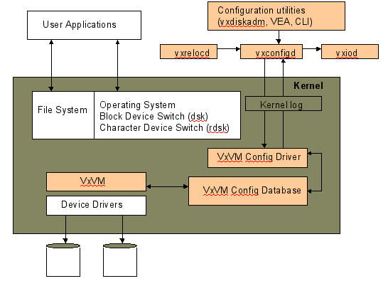
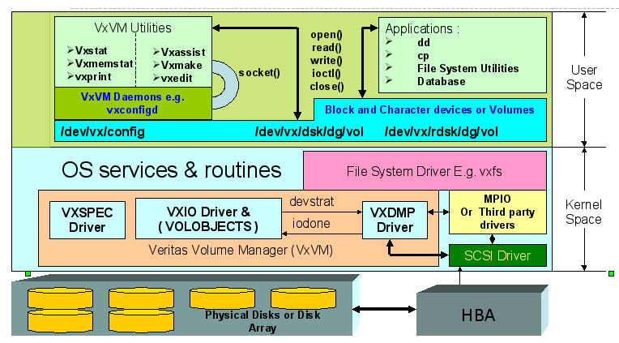
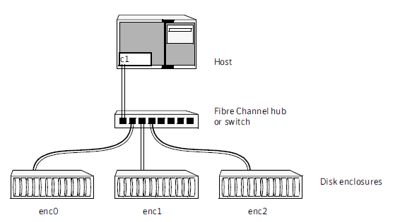
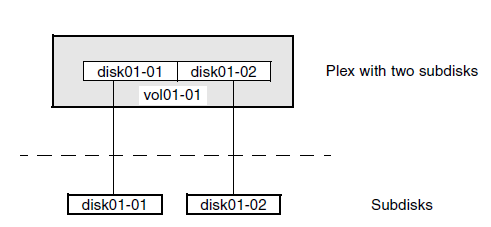
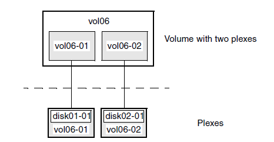
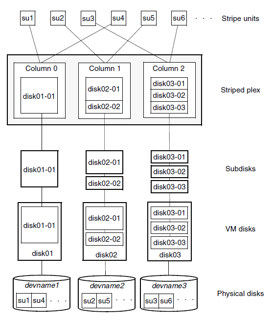
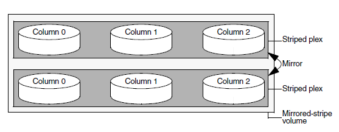
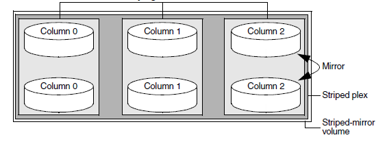
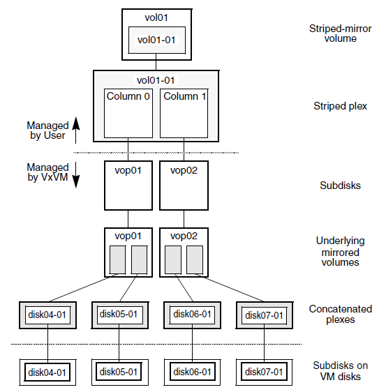

Symantec : VxVM
===============

.. contents::

Daemons
-------
*    **vxconfigd** - The VxVM configuration daemon maintains disk and group configurations and communicates configuration changes to the kernel, and modifies configuration information stored on disks.
*    **vxiod** - VxVM I/O kernel threads provide extended I/O operations without blocking calling processes. By default, 16 I/O threads are started at boot time, and at least one I/O thread must continue to run at all times.
*    **vxrelocd** - The hot-relocation daemon monitors VxVM for events that affect redundancy, and performs hot-relocation to restore redundancy.

Drivers
-------
*   VxVM Drivers:

   *    vxspec : Responsible for configuration changes, gathering statistics, monitoring tasks, starting kernel daemons etc.
   *    vxio : Is the first entry point for reading and writing VxVM volumes. All logical processing of IO operations initiates here.
   *    vxdmp : Is a multipathing driver and its job is to find out the various paths to the device and establish a one to many relationship between disk media (dm) and disk access(da) names.

*   Volume configuration service is the interface through which all changes to the volumes are performed. Vxconfigd daemon is the sole and exclusive owner of these devices.
*   Currently 8 volume conf devices exist.

   *    /dev/vx/[config,trace,iod,info,task,taskmon,clust,netiod].

*   All these devices are character devices with major no of vxspec driver.
*   All virtual disk devices (Volumes) are character and block devices with major no. of vxio driver.

Volobject
---------
It is a representation of all Volumes and their infrastructure that are visible to users and applications. These are kept inside kernel space. These are created once a volume is created (not always). All volobjects has their associated operation vectors that gets activated once operations are done, either by applications or vxconfigd. Volobjects are created, deleted or changed within transactions only.

Some volobjects types that are predefined in VxVM :

*    **Mirrored Volume (Default one)**. It has vol_mv_ops as Operation Vector
*    **Plexes**. It has volplex_ops as OV.
*    **Subdisks**. It has vol_subdisk_ops as OV.
*    **RVG (Replicated Volume Group)** for VVR. OV is vol_rv_ops.
*    **Replica Object**. OV is vol_rp_ops.
*    **Volume set**. OV is vol_vset_ops. 

::

        struct volobject {
                struct volobjectops * obj_ops;
                struct volobject *obj_name;
                struct volobject *obj_forw_sib;
                struct voldg *obj_dg;
                char *obj_name;
                volflag_t obj_flags;
                volflag_t obj_trans_flags;
                size_t obj_openrefcnt;
                size_t obj_iocount;
                struct vol_rwstats obj_stats
                struct voldevice *obj_vdev;
                volsleep_t obj_openclose;
        }

        struct volobjectops {
                char *oop_type;
                struct volsio * (*oop_iogen)();
                int (*oop_open)();
                int (*oop_close)();
                int (*oop_ioctl)();
                int (*oop_size)();
                int (*oop_voldget)();
                int (*oop_stats)();
                int (*oop_precommit();
                int (*oop_postcommit)();
                struct voldevice *obj_vdev;
                volsleep_t obj_openclose;
        }

Staged I/O
----------
An IO over a virtual object may in turn depend on IO over some other underlying virtual objects. Underlying virtual objects themselves handle the required operations and let the top level IO object to know the result. In this scenario the top level IO operation is broken in multiple stages where each stage also represent an IO. IO at each stage is known as SIO (Staged IO)

*    SIOs are formed as a concatenation of volsio structure with any additional information needed for handling the IO.
*    SIOs do not have one-to-one correspondence with KIO(Kernel I/O).
*    SIOs have a hierarchical relationship.

::

        struct volsio {
        struct volsioops        *sio_ops;
        struct volsio   *sio_next;
        struct volsio   *sio_forw;
        struct volsio   *sio_parent;
        struct volsio   *sio_object;
        volkio_t                *sio_kio;
        voff_t          sio_len;
        volflag_t               sio_flags;
        voff_t          sio_buff_offset;
        voff_t          sio_offset;
        int                     sio_errno;
        struct volsio   *sio_child;
        struct volsio   *sio_sibnext;
        }

        struct volsioops {
                char sop_type[16];
                int (*sop_start)();
                int (*sop_childdone)();
                int (*sop_done)();
                int (*sop_callback)();
                void (*sop_delete)();
        }

*   All the SIOs are generated from volobject's oop_iogen() function.
*   Mostly SIOs are picked by IO daemons from global SIO queues. IO daemons operate on three main SIO queues.

   *    volsioq_start : Queue of SIOs that need to be started.
   *    volsioq_idle_start : Queue of SIOs which can wait until the other queues are handled.
   *    volsioq_done : Queue of sios that are to be completed.
   *    volsioq_restart : Queue of SIOs to start later.
   *    volsioq_redone : Queue of SIO completions to be processed later.

I/O path
--------
*   Character type Virtual Devices :

   *    read, write are done through vxio_read(), vxio_write() and vxio_ioctl() routines.
   *    No IO buffer is passed through, instead user io or uio gets passed.
   *    Since IO buffer is not passed so it uses uphysio() to call volstrategy function.

*   Block type Virtual Devices :

   *    read, write are done through vxio_strategy and vxio_ioctl.
   *    vxio_strategy internally calls volstrategy routine.
   *    IO buffers are sent as chain of "bp"s to volstrategy. Chained via the av_forw field.
   *    volstrategy internally Calls volkiostart (for each buffer in the bp chain) to start the actual processing of IO. 

----------------
Kernel I/O (KIO)
----------------
*    It is a representation of buf struct.
*    It defines a virtual disk device, IO direction, an offset within the device, length and source and destination memory.
*    KIO is not an SIO. Though KIO is mostly reponsible for SIO.

-----------------
Generic I/O (GIO)
-----------------
*    This is an intermediate structure and is purely responsible for creating a staged IO (SIO).
*    volkiostart() creates GIO and calls volobject_iogen() to generate the corresponding SIO.
*    volobject_iogen calls oop_iogen of the volobject that is kept in GIO. 

-------------
voliod_loop()
-------------
*    It is an volume iodaemon loop. It checks the various queues for SIO and KIO processing and either go to sleep or work.
*    Process global queues : volsioq_done, volsioq_start, volkioq_start, volsioq_idle_start, volsioq_restart() and volsio_redone().
*    Gives priority to volsioq_done queue.

voliod_iohandle()
-----------------
*    Call SIO's start or done function
*    If the return code is -1 then append to restartq or redoneq

-------------
volkiostart()
-------------
*    IO processing starts here only.
*    It gets buf (volkio or kio) and kernel context.
*    Extract volobject based on the devno present in kio.
*    CheckVV if it is not in Interrupt context. If yes then put kio into volkioq_start queue and wakeup an iodaemon.
*    Check if transactions are going on. If yes then put into volkioq_commitwait_start queue.
*    Construct genio (GIO) using volobject and kio.
*    Get the sio by calling volobject_iogen().
*    Once sio is generated put the kio pointer in SIO.
*    Append the SIO in kernel context’s kc_startq.
*    If it is a fresh SIO then call its start function
*    By this time multiple child or nested SIOs might be appended in kc_startq.
*    Flush kc_startq, kc_doneq and kc_idle_startq.
*    Appends its entries in volsioq_start, volsioq_done and volsioq_idle_startq.
*    Wakeup IO Daemon.

I/O Stabilisation
-----------------
*    In some OS it is possible that the application process which has issued an IO request could have the pages mmaped and could change the contents while the IO request is in flight.
*    Stabilization is basically achieved by allocating a new IO buffer of same size, and IO operations will use the new buffer. Sometimes OS ensures stable buffers.
*    Mirror volumes may have multiple plexes and it is quite possible that if the IO buffer is not stable then same data will not be written in all the plexes.
*    VxIO ensures that before writing to plexes it creates the copy of the original buffer and writes the data from the copied buffer.
*    volsio_stabilize()

    *   Sets the flag VOLKIO_FLAG_STABLE.
    *   Copies Original Kernel IO buffers to the newly allocated buffer.
    *   Update SIO structure to use newly allocated KIO.
    *   Sets the flag VOLSIO_FLAG_STABILIZED

*    volsio_unstablize()

    *   Should be called on an SIO who has called volsio_stabilize()
    *   Frees the newly allocated buffer.
    *   Updates SIO structure to use original KIO.
    *   Resets flag VOLSIO_FLAG_STABILIZED.

DDL
---
**Device discovery** is the term used to describe the process of discovering the disks that are attached to a host. This feature is important for DMP because it needs to support a growing number of disk arrays from a number of vendors. In conjunction with the ability to discover the devices attached to a host, the Device Discovery service enables you to add support dynamically for new disk arrays. This operation, which uses a facility called the Device Discovery Layer (DDL), is achieved without the need for a reboot.

Enclosure-based Naming
----------------------
Enclosure-based naming allows VxVM to access enclosures as separate physical entities.

In such a configuration, enclosure-based naming can be used to refer to each disk within an enclosure. For example, the device names for the disks in enclosure enc0 are named enc0_0, enc0_1, and so on.

Objects
-------
Virtual objects in VxVM include the following:

*    Disk groups
*    VM disks
*    Subdisks
*    Plexes
*    Volumes

VM Disk
-------
When you place a physical disk under VxVM control, a VM disk is assigned to the physical disk. A VM disk is under VxVM control and is usually in a disk group. Each VM disk corresponds to at least one physical disk or disk partition. VxVM allocates storage from a contiguous area of VxVM disk space.

A VM disk typically includes a public region (allocated storage) and a small private region where VxVM internal configuration information is stored.

Each VM disk has a unique disk media name (a virtual disk name). You can either define a disk name of up to 31 characters, or allow VxVM to assign a default name that takes the form diskgroup##, where diskgroup is the name of the disk group to which the disk belongs.

Subdisks
--------
A subdisk is a set of contiguous disk blocks. A block is a unit of space on the disk. VxVM allocates disk space using subdisks. A VM disk can be divided into one or more subdisks. Each subdisk represents a specific portion of a VM disk, which is mapped to a specific region of a physical disk.

The default name for a VM disk is diskgroup## and the default name for a subdisk is diskgroup##-##, where diskgroup is the name of the disk group to which the disk belongs.

Plexes
------
VxVM uses subdisks to build virtual objects called plexes. A plex consists of one or more subdisks located on one or more physical disks.

You can organize data on subdisks to form a plex by using the following methods:

*    concatenation
*    striping (RAID-0)
*    mirroring (RAID-1)
*    striping with parity (RAID-5)

Volumes
-------
A volume is a virtual disk device that appears to applications, databases, and file systems like a physical disk device, but does not have the physical limitations of a physical disk device. A volume consists of one or more plexes, each holding a copy of the selected data in the volume. Due to its virtual nature, a volume is not restricted to a particular disk or a specific area of a disk. The configuration of a volume can be changed by using VxVM user interfaces.

VxVM uses the default naming conventions of vol## for volumes and vol##-## for plexes in a volume.

A volume may be created under the following constraints:

*    Its name can contain up to 31 characters.
*    It can consist of up to 32 plexes, each of which contains one or more subdisks.
*    It must have at least one associated plex that has a complete copy of the data in the volume with at least one associated subdisk.
*    All subdisks within a volume must belong to the same disk group.

Volume vol06 has the following characteristics:

*    It contains two plexes named vol06-01 and vol06-02.
*    Each plex contains one subdisk.
*    Each subdisk is allocated from a different VM disk (disk01 and disk02).

Volume Layout
-------------
A VxVM virtual device is defined by a volume. A volume has a layout defined by the association of a volume to one or more plexes, each of which map to subdisks. A VxVM virtual device is defined by a volume. A volume has a layout defined by the association of a volume to one or more plexes, each of which map to subdisks.

-----------------------
For non-layered volumes
-----------------------
In a non-layered volume, a subdisk is restricted to mapping directly to a VM disk. This allows the subdisk to define a contiguous extent of storage space backed by the public region of a VM disk. When active, the VM disk is directly associated with an underlying physical disk. The combination of a volume layout and the physical disks therefore determines the storage service available from a given virtual device.

-------------------
For Layered volumes
-------------------
A layered volume is constructed by mapping its subdisks to underlying volumes. The subdisks in the underlying volumes must map to VM disks, and hence to attached physical storage.

--------------
Layout Methods
--------------
Data in virtual objects is organized to create volumes by using the following layout methods:

*    Concatenation and spanning
*    Striping (RAID-0)
*    Mirroring (RAID-1)
*    Striping plus mirroring (mirrored-stripe or RAID-0+1)
*    Mirroring plus striping (striped-mirror, RAID-1+0 or RAID-10)
*    RAID-5 (striping with parity)

Concatenation maps data in a linear manner onto one or more subdisks in a plex. To access all of the data in a concatenated plex sequentially, data is first accessed in the first subdisk from beginning to end. Concatenation using subdisks that reside on more than one VM disk is called spanning.

Striping (RAID-0) is useful if you need large amounts of data written to or read from physical disks, and performance is important. Striping maps data so that the data is interleaved among two or more physical disks. A striped plex contains two or more subdisks, spread out over two or more physical disks. Data is allocated alternately and evenly to the subdisks of a striped plex. The default stripe unit size (or width) is 64 kilobytes. Striping continues for the length of the columns (if all columns are the same length), or until the end of the shortest column is reached. Any space remaining at the end of subdisks in longer columns becomes unused space.

Each column contains a different number of subdisks. There is one column per physical disk. Striped plexes can be created by using a single subdisk from each of the VM disks being striped across. It is also possible to allocate space from different regions of the same disk or from another disk (for example, if the size of the plex is increased). Columns can also contain subdisks from different VM disks.

[question why is it required that subdisks for striped plex come from different vm disks]

Mirroring uses multiple mirrors (plexes) to duplicate the information contained in a volume. In the event of a physical disk failure, the plex on the failed disk becomes unavailable, but the system continues to operate using the unaffected mirrors.
When striping or spanning across a large number of disks, failure of any one of those disks can make the entire plex unusable. Because the likelihood of one out of several disks failing is reasonably high, you should consider mirroring to improve the reliability (and availability) of a striped or spanned volume.

VxVM supports the combination of mirroring above striping. The combined layout is called a mirrored-stripe layout. A mirrored-stripe layout offers the dual benefits of striping to spread data across multiple disks, while mirroring provides redundancy of data.
For mirroring above striping to be effective, the striped plex and its mirrors must be allocated from separate disks.
The layout type of the data plexes in a mirror can be concatenated or striped. Even if only one is striped, the volume is still termed a mirrored-stripe volume. If they are all concatenated, the volume is termed a mirrored-concatenated volume.

VxVM supports the combination of striping above mirroring. This combined layout is called a striped-mirror layout. Putting mirroring below striping mirrors each column of the stripe. If there are multiple subdisks per column, each subdisk can be mirrored individually instead of each column.

A striped-mirror volume is an example of a layered volume. See “Layered volumes” on page 50 for more information.

As for a mirrored-stripe volume, a striped-mirror volume offers the dual benefits of striping to spread data across multiple disks, while mirroring provides redundancy of data. In addition, it enhances redundancy, and reduces recovery time after disk failure.

Figure 1-19 shows an example where a striped-mirror volume is created by using each of three existing 2-disk mirrored volumes to form a separate column within a striped plex.

If the layered volume concatenates instead of striping the underlying mirrored volumes, the volume is termed a concatenated-mirror volume.

Note: VxVM supports RAID-5 for private disk groups, but not for shareable disk groups in a cluster environment. In addition, VxVM does not support the mirroring of RAID-5 volumes that are configured using Veritas Volume Manager software. Disk devices that support RAID-5 in hardware may be mirrored.

--------------
RAID-5 logging
--------------
Logging is used to prevent corruption of data during recovery by immediately recording changes to data and parity to a log area on a persistent device such as a volume on disk or in non-volatile RAM. The new data and parity are then written to the disks.

Without logging, it is possible for data not involved in any active writes to be lost or silently corrupted if both a disk in a RAID-5 volume and the system fail. If this double-failure occurs, there is no way of knowing if the data being written to the data portions of the disks or the parity being written to the parity portions have actually been written. Therefore, the recovery of the corrupted disk may be corrupted itself.

--------------
Layered Volume
--------------
A layered volume is a virtual Veritas Volume Manager object that is built on top of other volumes. The layered volume structure tolerates failure better and has greater redundancy than the standard volume structure. For example, in a striped-mirror layered volume, each mirror (plex) covers a smaller area of storage space, so recovery is quicker than with a standard mirrored volume.

Online Relayout
---------------
Online relayout allows you to convert between storage layouts in VxVM, with uninterrupted data access.
The transformation is done by moving one portion of data at a time in the source layout to the destination layout. Data is copied from the source volume to the temporary area, and data is removed from the source volume storage area in portions.The source volume storage area is then transformed to the new layout, and the data saved in the temporary area is written back to the new layout. This operation is repeated until all the storage and data in the source volume has been transformed to the new layout.
As well as the temporary area, space is required for a temporary intermediate volume when increasing the column length of a striped volume. The amount of space required is the difference between the column lengths of the target and source volumes. For example, 20GB of temporary additional space is required to relayout a 150GB striped volume with 5 columns of length 30GB as 3 columns of length 50GB. In some cases, the amount of temporary space that is required is relatively large. For example, a relayout of a 150GB striped volume with 5 columns as a concatenated volume (with effectively one column) requires 120GB of space for the intermediate volume.

Note the following limitations of online relayout:

*    Log plexes cannot be transformed.
*    Volume snapshots cannot be taken when there is an online relayout operation running on the volume.
*    Online relayout cannot create a non-layered mirrored volume in a single step. It always creates a layered mirrored volume even if you specify a non-layered mirrored layout, such as mirror-stripe or mirror-concat. Use the vxassistconvert command to turn the layered mirrored volume that results from a relayout into a non-layered volume. See “Converting between layered and non-layered volumes” on page 308 for more information.
*    Online relayout can be used only with volumes that have been created using the vxassist command or the Veritas Enterprise Administrator (VEA).
*    The usual restrictions apply for the minimum number of physical disks that are required to create the destination layout. For example, mirrored volumes require at least as many disks as mirrors, striped and RAID-5 volumes require at least as many disks as columns, and striped-mirror volumes require at least as many disks as columns multiplied by mirrors.
*    To be eligible for layout transformation, the plexes in a mirrored volume must have identical stripe widths and numbers of columns. Relayout is not possible unless you make the layouts of the individual plexes identical.
*    Online relayout involving RAID-5 volumes is not supported for shareable disk groups in a cluster environment.
*    Online relayout cannot transform sparse plexes, nor can it make any plex sparse. (A sparse plex is not the same size as the volume, or has regions that are not mapped to any subdisk.)
*    The number of mirrors in a mirrored volume cannot be changed using relayout.

Only one relayout may be applied to a volume at a time.

Volume resynchronization
------------------------
When storing data redundantly and using mirrored or RAID-5 volumes, VxVM ensures that all copies of the data match exactly. However, under certain conditions (usually due to complete system failures), some redundant data on a volume can become inconsistent or unsynchronized. The mirrored data is not exactly the same as the original data. Except for normal configuration changes (such as detaching and reattaching a plex), this can only occur when a system crashes while data is being written to a volume.

VxVM records when a volume is first written to and marks it as dirty. When a volume is closed by all processes or stopped cleanly by the administrator, and all writes have been completed, VxVM removes the dirty flag for the volume. Only volumes that are marked dirty when the system reboots require resynchronization.

The process of resynchronization depends on the type of volume. RAID-5 volumes that contain RAID-5 logs can “replay” those logs. If no logs are available, the volume is placed in reconstruct-recovery mode and all parity is regenerated. For mirrored volumes, resynchronization is done by placing the volume in recovery mode (also called read-writeback recovery mode).

For large volumes or for a large number of volumes, the resynchronization process can take time. These effects can be addressed by using dirty region logging (DRL) and FastResync (fast mirror resynchronization) for mirrored volumes, or by ensuring that RAID-5 volumes have valid RAID-5 logs. For raw volumes used by database applications, the SmartSync feature can be used if this is supported by the database vendor.

--------------------
Dirty Region Logging
--------------------
Dirty region logging (DRL), if enabled, speeds recovery of mirrored volumes after a system crash. DRL keeps track of the regions that have changed due to I/ O writes to a mirrored volume. DRL uses this information to recover only those portions of the volume that need to be recovered.

DRL logically divides a volume into a set of consecutive regions, and maintains a log on disk where each region is represented by a status bit. This log records regions of a volume for which writes are pending. Before data is written to a region, DRL synchronously marks the corresponding status bit in the log as dirty. To enhance performance, the log bit remains set to dirty until the region becomes the least recently accessed for writes.

DRL log subdisks store the dirty region log of a mirrored volume that has DRL enabled. A volume with DRL has at least one log subdisk; multiple log subdisks can be used to mirror the dirty region log. Each log subdisk is associated with one plex of the volume. Only one log subdisk can exist per plex. If the plex contains only a log subdisk and no data subdisks, that plex is referred to as a log plex.

The log subdisk can also be associated with a regular plex that contains data subdisks. In that case, the log subdisk risks becoming unavailable if the plex must be detached due to the failure of one of its data subdisks.

Some volumes, such as those that are used for database replay logs, are written sequentially and do not benefit from delayed cleaning of the DRL bits. For these volumes, sequential DRL can be used to limit the number of dirty regions. This allows for faster recovery should a crash occur. However, if applied to volumes that are written to randomly, sequential DRL can be a performance bottleneck as it limits the number of parallel writes that can be carried out.

------------------------------
Smartsync recovery accelerator
------------------------------
The SmartSync feature of Veritas Volume Manager increases the availability of mirrored volumes by only resynchronizing changed data. (The process of resynchronizing mirrored databases is also sometimes referred to as resilvering.) SmartSync reduces the time required to restore consistency, freeing more I/O bandwidth for business-critical applications. If supported by the database vendor, the SmartSync feature uses an extended interface between VxVM volumes and the database software to avoid unnecessary work during mirror resynchronization. For example, Oracle® automatically takes advantage of SmartSync to perform database resynchronization when it is available.

The SmartSync feature of Veritas Volume Manager is only applicable to databases that are configured on raw volumes. You cannot use it with volumes that contain file systems. Use an alternative solution such as the Oracle Resilvering feature of Veritas File System (VxFS).

You must configure volumes correctly to use SmartSync. For VxVM, there are two types of volumes used by the database, as follows:

*    Data volumes are all other volumes used by the database (control files and tablespace files).
*    Redo log volumes contain redo logs of the database.

SmartSync works with these two types of volumes differently, so they must be configured as described in the following sections.

Because the database keeps its own logs, it is not necessary for VxVM to do logging. Data volumes should be configured as mirrored volumes without dirty region logs.

A redo log is a log of changes to the database data. Because the database does not maintain changes to the redo logs, it cannot provide information about which sections require resilvering.The enhanced interfaces for redo logs allow the database software to inform VxVM when a volume is to be used as a redo log. This allows VxVM to modify the DRL behavior of the volume to take advantage of the access patterns.

Volume Snapshots
----------------
The traditional type of volume snapshot in VxVM is of the third-mirror break-off type. This name comes from its implementation where a snapshot plex (or third mirror) is added to a mirrored volume. The contents of the snapshot plex are then synchronized from the original plexes of the volume. When this synchronization is complete, the snapshot plex can be detached as a snapshot volume for use in backup or decision support applications. At a later time, the snapshot plex can be reattached to the original volume, requiring a full resynchronization of the snapshot plex’s contents.

The FastResync feature was introduced to track writes to the original volume. This tracking means that only a partial, and therefore much faster, resynchronization is required on reattaching the snapshot plex. In later releases, the snapshot model was enhanced to allow snapshot volumes to contain more than a single plex, reattachment of a subset of a snapshot volume’s plexes, and persistence of FastResync across system reboots or cluster restarts.

Release 4.0 of VxVM introduced full-sized instant snapshots and space-optimized instant snapshots, which offer advantages over traditional third-mirror snapshots such as immediate availability and easier configuration and administration. You can also use the third-mirror break-off usage model with full-sized snapshots, where this is necessary for write-intensive applications

=====================================================================   ===========================     ================================        ==============================
Snapshot feature                                                        Full-sized instant (vxsnap)     Space-optimized instant (vxsnap)        Break-off (vxassist or vxsnap)
=====================================================================   ===========================     ================================        ==============================
Immediately available for use on creation                               Yes                             Yes                                     No   
Requires less storage space than original volume                        No                              Yes                                     No
Can be reattached to original volume                                    Yes                             No                                      Yes
Can be used to restore contents of original volume                      Yes                             Yes                                     Yes
Can quickly be refreshed without being reattached                       Yes                             Yes                                     No
Snapshot hierarchy can be split                                         Yes                             No                                      No
Can be moved into separate disk group from original volume              Yes                             No                                      Yes
Can be turned into an independent volume                                Yes                             No                                      Yes
FastResync ability persists across system reboots or cluster restarts   Yes                             Yes                                     Yes
Synchronization can be controlled                                       Yes                             No                                      No
=====================================================================   ===========================     ================================        ==============================

Fast Resync
-----------
FastResync optimizes mirror resynchronization by keeping track of updates to stored data that have been missed by a mirror. When a mirror returns to service, only the updates that it has missed need to be re-applied to resynchronize it.
FastResync allows you to refresh and re-use snapshots rather than discard them. You can quickly re-associate (snapback) snapshot plexes with their original volumes.

Non-persistent FastResync allocates its change maps in memory. If non-persistent FastResync is enabled, a separate FastResync map is kept for the original volume and for each snapshot volume. Unlike a dirty region log (DRL), they do not reside on disk nor in persistent store. This has the advantage that updates to the FastResync map have little impact on I/O performance, as no disk updates needed to be performed. However, if a system is rebooted, the information in the map is lost, so a full resynchronization is required on snapback. This limitation can be overcome for volumes in cluster-shareable disk groups, provided that at least one of the nodes in the cluster remained running to preserve the FastResync map in its memory. However, a node crash in a High Availability (HA) environment requires the full resynchronization of a mirror when it is reattached to its parent volume.

The snapshot feature of VxVM takes advantage of FastResync change tracking to record updates to the original volume after a snapshot plex is created. After a snapshot is taken, the snapback option is used to reattach the snapshot plex.

If persistent FastResync is enabled on a volume or on a snapshot volume, a data change object (DCO) and a DCO volume are associated with the volume.

----------
DCO volume
----------
The internal layout of the DCO volume changed in VxVM 4.0 to support new features such as full-sized and space-optimized instant snapshots. Because the DCO volume layout is versioned, VxVM software continues to support the version 0 layout for legacy volumes. However, you must configure a volume to have a version 20 DCO volume if you want to take instant snapshots of the volume.

In VxVM release 3.2, the DCO object only managed information about the FastResync maps. These maps track writes to the original volume and to each of up to 32 snapshot volumes since the last snapshot operation. Each plex of the DCO volume on disk holds 33 maps, each of which is 4 blocks in size by default.

In VxVM 4.0 and later releases, the DCO object is used not only to manage the FastResync maps, but also to manage DRL recovery maps (see “Dirty region logging” on page 59) and special maps called copymaps that allow instant snapshot operations to resume correctly following a system crash.

The layout of a version 20 DCO volume includes an accumulator that stores the DRL map and a per-region state map for the volume, plus 32 per-volume maps (by default) including a DRL recovery map, and a map for tracking detaches that are initiated by the kernel due to I/O error. The remaining 30 per-volume maps (by default) are used either for tracking writes to snapshots, or as copymaps.

Hot Relocation
--------------
VxVM detects I/O failures on objects and relocates the affected subdisks. The subdisks are relocated to disks designated as spare disks and/or free space within the disk group. VxVM then reconstructs the objects that existed before the failure and makes them accessible again.
When a partial disk failure occurs (that is, a failure affecting only some subdisks on a disk), redundant data on the failed portion of the disk is relocated. Existing volumes on the unaffected portions of the disk remain accessible.

Volume sets
-----------
Volume sets are an enhancement to VxVM that allow several volumes to be represented by a single logical object. All I/O from and to the underlying volumes is directed via the I/O interfaces of the volume set. The volume set feature supports the multi-volume enhancement to Veritas File System (VxFS). This feature allows file systems to make best use of the different performance and availability characteristics of the underlying volumes. For example, file system metadata could be stored on volumes with higher redundancy, and user data on volumes with better performance.

Disk Naming
-----------
There are two different methods of naming disk devices:

*    hdx and sdx based naming
*    Enclosure based naming

------------------------
hdx and sdx based naming
------------------------
In this naming scheme, all disk devices are named using the hdx[N] or sdx[N] format, where x is a letter that indicates the order of EIDE (hd) or SCSI (sd) disks seen by the operating system, and N is an optional partition number in the range 1 through 15.

----------------------
Enclosure Based Naming
----------------------
Enclosure-based naming operates as follows:

*    Devices with very long device names (for example, Fibre Channel devices that include worldwide name (WWN) identifiers) are always represented by enclosure-based names.
*    All disks in supported disk arrays are named using the enclosure_name_# format. For example, disks in the supported disk array, enggdept are named enggdept_0, enggdept_1, enggdept_2 and so on.
*    Disks in the DISKS category (JBOD disks) are named using the Disk_# format.
*    A disk partition is indicated by appending s# to the name, where # is the partition number. For example, Disk_0s5 and Disk_0s6 indicate the extended partitions that are used for the private and public regions of the sliced disk, Disk_0.
*    Disks in the OTHER_DISKS category (disks that are not multipathed by DMP) cannot use this scheme, and are named using the hdx[N] or sdx[N] format.

To display native os device name

::

        # vxdisk path | egrep <diskname>

To change disk-naming scheme

::

        # To set enclosure-based naming scheme
        vxddladm set namingscheme=ebn [persistence=yes|no]

        # To set OS based naming scheme
        vxddladm set namingscheme=osn [persistence=yes|no]

        # To get the current naming scheme
        vxddladm get namingscheme

        # To convert DA (disk access) name to DM (disk media/OS) names
        vxdmpadm getsubpaths dmpnodename=<da_name>

Disk Regions
------------
Most VM disks have two regions:

--------------
private region
--------------
A small area where configuration information is stored. A disk header label, configuration records for VxVM objects (such as volumes, plexes and subdisks), and an intent log for the configuration database are stored here. The default private region size is 32 megabytes, which is large enough to record the details of several thousand VxVM objects in a disk group.
Each disk that has a private region holds an entire copy of the configuration database for the disk group. The size of the configuration database for a disk group is limited by the size of the smallest copy of the configuration database on any of its member disks.

-------------
public region
-------------
An area that covers the remainder of the disk, and which is used for the allocation of storage space to subdisks

Disk Type
---------
A disk's type identifies how VxVM accesses a disk, and how it manages the disk's private and public regions. The following disk access types are used by VxVM:

------
simple
------
The public and private regions are both configured on a single extended partition, such as partition 5, with the public area following the private area. The partition number (displayed as # or s#, depending on the naming scheme) is always displayed in command output for simple disks.

------
sliced
------
The private and public regions are configured on different extended partitions: partition 5 for the private region, and partition 6 for the public region.

------
nopriv
------
There is no private region (only a public region for allocating subdisks). This is the simplest disk type consisting only of space for allocating subdisks. Such disks are most useful for defining special devices (such as RAM disks, if supported) on which private region data would not persist between reboots. They can also be used to encapsulate disks where there is insufficient room for a private region.

----
auto
----
When the vxconfigd daemon is started, VxVM obtains a list of known disk device addresses from the operating system and configures disk access records for them automatically.

Auto-configured disks (with disk access type auto) support the following disk formats:

*    **cdsdisk** - The disk is formatted as a Cross-platform Data Sharing (CDS) disk that is suitable for moving between different operating systems. This is the default format for disks that are not used to boot the system.Typically, most disks on a system are configured as this disk type. However, it is not a suitable format for boot, root or swap disks, for mirrors or hot-relocation spares of such disks, or for Extensible Firmware Interface (EFI) disks. Also note that partition 3 is used for both the private and public regions of a CDS disk.
*    **simple** - The disk is formatted as a simple disk that can be converted to a CDS disk.
*    **sliced** - The disk is formatted as a sliced disk. This format can be applied to disks that are used to boot the system. The disk can be converted to a CDS disk if it was not initialized for use as a boot disk.

Discovering new devices
-----------------------
vxdisk scandisks or vxdctl enable command can be used to discover devices. The commands also trigger chnages in DMP configuration.

::

        # To discover all devices added to the system, does not require reboot
        vxdisk scandisks or vxdctl enable

        # To discover only new devices added to the system, or devices that were in enabled or disable 
        vxdisk -f scandisks or vxdctl -f enable

        # To discover only new devices added to the system
        vxdisk scandisks new

        # To discover only fabric devices
        vxdisk scandisks fabric

        # To discover only specific devices 
        vxdisk scandisks device=sdm,sdn
        vxdisk scandisks ctrl=c1,c2  # logical controller
        vxdisk scandisks pctrl=c1+c2 # physical controller

        # To discover all devices except specific devices
        vxdisk scandisks \!device=sdm,sdn
        vxdisk scandisks \!ctrl=c1,c2  # logical controller
        vxdisk scandisks \!pctrl=c1+c2 # physical controller

Device Discovery Layer
----------------------

::

        # To list the supported disk arrays
        vxddladm listsupport all

        # To list the details of a specific library
        vxddladm listsupport libname=libvxfujitsu.so

        # To exclude support for a disk array
        vxddladm excludearray libname=libvxemc.so
        vxddladm excludearray [vid=vendor-id] [pid=product-id]

        # To include support for a disk array
        vxddladm includearray libname=libvxemc.so
        vxddladm includearray [vid=vendor-id] [pid=product-id]

        # To list all the excluded arrays
        vxddladm listexclude

        # To list the supported disks in DISKS category
        vxddladm listjbod

Manually adding unsupported disks to DISKS

::

        # Find the vendor and product id of the device 
        /etc/vx/diag.d/vxdmpinq /dev/sda

        # To add a new JBOD category
        vxddladm addjbod vid=<vendorid> pid=<productid> [length=<serialno_length>]

        # To remove a jBOD category
        vxddladm rmjbod vid=<vid> [pid=<pid>]

To add foreign devices which are contorlled by third-party drivers, such as those that provide multipathing or RAM disks

::

        # To add a foreign device to ddl
        vxddladm addforeign [blockdir=/dev/foo/dsk chardir=/dev/foo/rdsk]

Additional DDL commands provided in MP3

::

        # To list all the devices
        vxddladm list

        # To list all the HBAs and iSCSI adapters
        vxddladm list hbas

        # To list the ports configured on HBAs
        vxddladm list ports

        # To list the configured targets on a HBA
        vxddladm list targets
        vxddladm list targets [hba=<hba_name> | port=<port_name>]

        # To list the devices on a HBA or target
        vxddladm list devices [target=<target_name>]

        # To set/get iSCSI operational parameters
        vxddladm getiscsi target=<target_name> {all | <parameter>}
        vxddladm setiscsi target=<target_name> <parameter>=<value>

Disk administration commands
----------------------------

::

        # To list the disk that are known to VxVM(need not be under VM control)
        vxdisk list

        # To display detailed information about a individual disk
        vxdisk -v list <diskname>

        # To add a uninitalised disk to VxVM control
        vxdisk [[-o coordinator] -f] init <disk_name> 
                        type={simple | sliced | auto [format={simple|sliced|cdsdisk}} [attribute]
        # If the above command fails, try to initalise the disk manually and try 
        # the step again
        fdisk /dev/sdb
        Command (m for help): o 
        Command (m for help): w
        vxdisk [[-o coordinator] -f] init <disk_name> 
                        type={simple | sliced | auto [format={simple|sliced|cdsdisk}} [attribute]

        # To remove the disk from VxVM control, (the disk should not be part of any DG)
        vxdiskunsetup sdb

        # To rename a disk 
        vxedit [-g <dg>] rename <old_name> <new_name>

        # To reserve a disk for special purposes 
        vxedit [-g <dg>] set reserve=on <diskname>

        # To remove a reservation
        vxedit [-g <dg>] set reserve=off <disk_name>

---------------------
To encapsulate a disk
---------------------

*    The disk should have atleast 2 partitions one for storing private region, other for public.
*    The private region would require 32MB of free space at the start or end of the disk. 

Follow the prompts in vxdiskadm to encapsulate a disk

nopriv disk can be used to encapsulate a partition for use with VxVM

::

        vxdisk define sda3 type=norpiv

If a LUN expanded/shrunk on the array side, VxVM can be asked identify the new size. Size changes should be done only at the last byte of the lun not the first byte. If a shrink can be accomodated without any disrupion to plexes the shrink is performed.
To notify VxVM of expand/shrink to a LUN

::

        vxdisk [-f] [-g diskgroup] resize {accessname|medianame} \ [length=value]

Extended Copy service
---------------------
The Extended Copy Service feature of VxVM works in tandem with the extended copy engines from array vendors. When VxVM detects that the source and destination devices are enabled for extended copy, VxVM automatically off loads copy requests to the array’s copy manager.

To see whether the Extended Copy Service feature is enabled on a disk, use the vxprint command as shown in the following example. The feature is enabled if an ecopy_enabled entry appears in the flags line.

::

        # vxprint -l disk03
        Disk group: rootdg
        Disk: disk03
        info: diskid=1234567890.59.vm250e1.veritas.com
        assoc: device=c2t2d0s2 type=auto
        flags: autoconfig ecopy_enabled
        device: path=/dev/vx/dmp/c2t2d0s4
        devinfo: publen=35354136 privlen=9167

DMP
---

Array types are

-------------
Active/Active
-------------
An Active/Active disk array (A/A arrays) permits several paths to be used concurrently for I/O. In the event that one path fails, DMP automatically routes I/O over the other available paths.

A/A-A or Asymmetric Active/Active arrays can be accessed through secondary storage paths with little performance degradation. Usually an A/A-A array behaves like an A/P array rather than an A/A array. However, during failover, an A/A-A array behaves like an A/A array.

--------------
Active/Passive
--------------
An Active/Passive array (A/P array) allows access to its LUNs via the primary (active) path on a single controller (also known as an access port or a storage processor) during normal operation.

In implicit failover mode (or autotrespass mode), an A/P array automatically fails over by scheduling I/O to the secondary (passive) path on a separate controller if the primary path fails. This passive port is not used for I/O until the active port fails. In A/P arrays, path failover can occur for a single LUN if I/O fails on the primary path.

For Active/Passive arrays with LUN group failover (A/PG arrays), a group of LUNs that are connected through a controller is treated as a single failover entity. Unlike A/P arrays, failover occurs at the controller level, and not for individual LUNs. The primary and secondary controller are each connected to a separate group of LUNs. If a single LUN in the primary controller’s LUN group fails, all LUNs in that group fail over to the secondary controller.

Active/Passive arrays in explicit failover mode (or non-autotrespass mode) are termed A/PF arrays. DMP issues the appropriate low-level command to make the LUNs fail over to the secondary path.

A/P-C, A/PF-C and A/PG-C arrays are variants of the A/P, AP/F and A/PG array types that support concurrent I/O and load balancing by having multiple primary paths into a controller. This functionality is provided by a controller with multiple ports, or by the insertion of a SAN hub or switch between an array and a controller. Failover to the secondary (passive) path occurs only if all the active primary paths fail.

--------------
Load Balancing
--------------
For Active/Passive disk arrays, I/O is sent down the primary path. If the primary path fails, I/O is switched over to the other available primary paths or secondary paths. As the continuous transfer of ownership of LUNs from one controller to another results in severe I/O slowdown, load balancing across paths is not performed for Active/Passive disk arrays unless they support concurrent I/O.

Both paths of an Active/Passive array are not considered to be on different controllers when mirroring across controllers (for example, when creating a volume using vxassistmake specified with the mirror=ctlr attribute).

For A/P-C, A/PF-C and A/PG-C arrays, load balancing is performed across all the currently active paths as is done for Active/Active arrays.

--------------
DMP Monitoring
--------------
DMP maintains a pool of kernel threads that are used to perform such tasks as error processing, path restoration, statistics collection, and SCSI request callbacks. The vxdmpadmstat command can be used to provide information about the threads. The names errord and restored have been retained for backward compatibility.

One kernel thread responds to I/O failures on a path by initiating a probe of the host bus adapter (HBA) that corresponds to the path. Another thread then takes the appropriate action according to the response from the HBA. The action taken can be to retry the I/O request on the path, or to fail the path and reschedule the I/O on an alternate path.

The restore kernel thread is woken periodically (typically every 5 minutes) to check the health of the paths, and to resume I/O on paths that have been restored. As some paths may suffer from intermittent failure, I/O is only resumed on a path if has remained healthy for a given period of time.

--------------
I/O Throttling
--------------
If I/O throttling is enabled, and the number of outstanding I/O requests builds up on a path that has become less responsive, DMP can be configured to prevent new I/O requests being sent on the path either when the number of outstanding I/O requests has reached a given value, or a given time has elapsed since the last successful I/O request on the path. While throttling is applied to a path, the outstanding I/O requests on that path are scheduled on other available paths. The throttling is removed from the path if the HBA reports no error on the path, or if an outstanding I/O request on the path succeeds

----------------------------
DMP in clustered environment
----------------------------
In a clustered environment where Active/Passive type disk arrays are shared by multiple hosts, all nodes in the cluster must access the disk via the same physical path. Accessing a disk via multiple paths simultaneously can severely degrade I/O performance (sometimes referred to as the ping-pong effect). Path failover on a single cluster node is also coordinated across the cluster so that all the nodes continue to share the same physical path.

For Active/Active type disk arrays, any disk can be simultaneously accessed through all available physical paths to it. In a clustered environment, the nodes do not all need to access a disk via the same physical path.

----------------------------------------------------
Enabling/Disabling I/O to controller/ports/SPs/paths
----------------------------------------------------
DMP allows you to turn off I/O for a controller or the array port of a storage processor so that you can perform administrative operations. This feature can be used for maintenance of HBA controllers on the host, or array ports that are attached to disk arrays supported by VxVM. I/O operations to the controller or array port can be turned back on after the maintenance task is completed. You can accomplish these operations using the vxdmpadm command provided with VxVM.

In Active/Active type disk arrays, VxVM uses a balanced path mechanism to schedule I/O to multipathed disks. As a result, I/O may go through any available path at any given point in time. For example, if a system has an Active/Active storage array, and you need to change an interface board that is connected to this disk array (if supported by the hardware), you can use the vxdmpadm command to list the controllers that are connected to the interface board. Disable the controllers to stop further I/O to the disks that are accessed through the interface board. You can then replace the board without causing disruption to any ongoing I/O to disks in the disk array.a

In Active/Passive type disk arrays, VxVM schedules I/O to use the primary path until a failure is encountered. To change the interface card for an array port or an HBA controller card on the host (if supported by the hardware) that is connected to the disk array, disable I/O operations to the array port or to the HBA controller. This shifts all I/O over to an active secondary path or to an active primary path on another controller so that you can change the hardware.a

After the operation is over, you can use vxdmpadm to re-enable the paths through the controllers.

::

        vxdmpadm [-c | -f] disable {ctlr=<> | enclosure=<> portid=<> | path=<> | pwwn=<>}
                       [enclosure=<>] [type=<>]

        vxdmpadm [-c | -f] enable {ctlr=<> | enclosure=<> portid=<> | path=<> | pwwn=<>}
                       [enclosure=<>] [type=<>]

--------------------------------------------------------------------
Enabling/Disabling multipathing and making devices invisible to VxVM
--------------------------------------------------------------------
You can use vxdiskadm menu options 17 and 18 to disable or enable multipathing. These menu options also allow you to exclude or exclude devices from the view of VxVM.

---------------------------------------------
Renaming DMP node names (DA names)/Enclosures
---------------------------------------------
User specified names are persistent even if names persistenece is turned off.

::

        vxdmpadm setattr dmpnode <dmpnodename> name=<new_name>
        vxdmpadm setattr enclosure <encl_name> name=<new_name>

        # To assign names from a file
        vxddladm assing names file=<pathname>

----------------------
Administering vxdmpadm
----------------------

::

        # To get OS names (DM name) from dmpnodename(DA name)
        vxdmpadm getdmpnode nodename=<os_name>
        vxdmpadn getdmpnode nodenmae=sda
        vxdmpadm getdmpnode enclosure=<encl_name>

        # To get dmpnodename(DA name) from OS names(DM names)
        vxdmpadm getsubpaths dmpnodename=<>
        vxdmpadm getsubpaths dmpnodename=Disk_1
        vxdmpadm getsubpaths [ctlr=<> | dmpnodename=<> | enclosure=<> portid=<> | pwwn=<> | tpdnodename=<>]

        # To get the DMP nodes that are there in the same LUN group as a specified node
        vxdmpadm getlungroup dmpnodename=<>

        # To list the information about the controllers
        vxdmpadm listctlr { all | ctlr=<> | enclosure=<> | type=<> }

        # To list the enclosures 
        vxdmpadm listenclosure { all | <enclosure_name> }

        # To display information about the portids
        vxdmpadm getportids { path=<os_path> | ctlr=<> | dmpnodename=<> | enclosure=<> }

        # To display information about TPD controlled devices
        vxdmpadm gettpdnode [nodename=<>]

        # To display extended attributes 
        vxdisk -p list

        # DMP I/O statistics
        # To turn on io statistics collection
        vxdmpadm iostat start [memory=<size>]
        vxdmpadm iostat reset
        vxdmpadm iostat stop
        # To see the current statistics
        vxdmpadm iostat show {all | ctlr=<> | enclosure=<> | dmpnodename=<> | pathname=<>}
                             [interval=<seconds> [count=<n>]]

        # DMP path attributes
        vxdmpadm setattr path <path_name> pathtype={primary | secondary | nomanual|
                                standby | active | nopreferred | preferred [priority=N]}
        vxdmpadm getattr path <path_name> pathtype
        # active - changes a path to an active path ( for A/P-C)
        # nomanual - restores the original primary or secondary attributes of the path
        # preferred - specifies the path as preferred with priority(0 is low) (for A/A)
        # nopreferred - restores the normal prirority of the path (for A/A)
        # primary - defines the path as primary path (for A/P)
        # secondary - defines the path as secondary path (for A/P)
        # standby - defines the path for failover (for A/P-C)

        # DMP I/O Policies
        vxdmpadm setattr {enclosure enclr_name | arrayname array_name |
                          arraytype {A/A|A/P|...}} iopolicy=<> [use_all_paths={yes|no}]
        # Defined I/O polices in DMP are
        # adaptive - 
        #            This policy attempts to maximize overall I/O throughput 
        #            from/to the disks by dynamically scheduling I/O on the paths. 
        #            It is suggested for use where I/O loads can vary over time.
        # balanced [partitionsize=<size>] -          
        #            This policy is designed to optimize the use of caching in 
        #            disk drives and RAID controllers. The size of the cache typically
        #            ranges from 120KB to 500KB or more, depending on the 
        #            characteristics of the particular hardware. During normal 
        #            operation, the disks (or LUNs) are logically divided into a 
        #            number of regions (or partitions), and I/O from/to a given region
        #            is sent on only one of the active paths. Should that path fail, 
        #            the workload is automatically redistributed across the remaining 
        #            paths. You can use the size argument to the partitionsize 
        #            attribute to specify the partition size.
        #            The default value for the partition size is 2048 blocks (1MB). 
        # minimumq -
        #            sends I/O on paths that have the minimum number of outstanding I/O 
        # priority -
        # round-robin - 
        # singleactive -
        # use_all_paths - whether I/O requests are to be scheduled on the secondary 
        #                 paths in addition to the primary paths of an Asymmetric 
        #                 Active/Active (A/A-A) array.
        #                 It has no effect for array types other than A/A-A.

        # DMP response to I/O failures
        vxdmpadm setattr {enclosure <> | arrayname <> | arraytype {A/A|A/P|...}} 
                         recoveryoption={fixedretry retrycount=N |
                                         timebound iotimeout=secs |
                                         default}
        vxdmpadm getattr {enclosure <> | arrayname <> | arraytype {A/A|A/P|...}} 
                         recoveryoption
        # fixedretry - retry for retrycount times before rescheduleing on another path
        # timebound - wait for iotimeout seconds before reschedueling on another path
        vxdmpadm setattr {enclosure <> | arrayname <> | arraytype {A/A|A/P|...}} 
                         recoveryoption=throttle {iotimeout=seconds | queuedepth=N}

        # DMP threads
        # DMP restore thread, examines the conditions of paths at a specified interval
        vxdmpadm start restore [interval=<secs>] 
                               policy={check_all | check_alternate | check_disabled|
                                       check_periodic [period=<n>]}
        vxdmpadm stat restored
        vxdmpadm stat errord
        vxdmpadm stop restore
        # check_alternate - check if atleast one used and one alternate path is 
        #                   available, sends a notification otherwise
        # check_periodic - do check_all every <period> cycles, and check_disabled
        #                  during every cycle

        # DMP array policy modules
        # An array policy module(APM) is a dynamically loadable kernel module that
        #    may be provided by some vendors for use in conjunction with an array. 
        # An APM defines procedures to:
        #      Select an I/O path when multiple paths to a disk within the array are available.
        #      Select the path failover mechanism.
        #      Select the alternate path in the case of a path failure.
        #      Put a path change into effect.
        #      Respond to SCSI reservation or release requests.
        # DMP supplies default procedures for these functions when an array is registered. 
        # An APM may modify some or all of the existing procedures that are provided 
        #    by DMP or by another version of the APM.
        vxdmpadm listapm all
        # The output from this command includes the file name of each module, 
        #     the supported array type, the APM name, the APM version, and whether 
        #     the module is currently in use (loaded).
        vxdmpadm listapm module_name
        # To add and configure an APM, use the following command:
        vxdmpadm -a cfgapm <module_name> [attr1=value1 [attr2=value2...]]
        # To delete a configured APM
        vxdmpadm -r cfgapm <module_name>
        # To use an older version of APM
        vxdmpadm -u cfgapm <module_name>

Disk groups
-----------
Disk groups are named collections of disks that share a common configuration. Volumes are created within a disk group and are restricted to using disks within that disk group.

When a disk is added to a disk group, it is given a name (for example, mydg02). This name identifies a disk for operations such as volume creation or mirroring. The name also relates directly to the underlying physical disk. If a physical disk is moved to a different target address or to a different controller, the name mydg02 continues to refer to it.a

Having disk groups that contain many disks and VxVM objects causes the private region to fill. In the case of large disk groups that are expected to contain more than several hundred disks and VxVM objects, disks should be set up with larger private areas. A major portion of a private region provides space for a disk group configuration database that contains records for each VxVM object in that disk group. Because each configuration record takes up approximately 256 bytes, the number of records that can be created in a disk group can be estimated from the configuration database copy size. The copy size in blocks can be obtained from the output of the command vxdglist diskgroup as the value of the permlen parameter on the line starting with the string “config:”. This value is the smallest of the len values for all copies of the configuration database in the disk group. The amount of remaining free space in the configuration database is shown as the value of the free parameter.

-------------------------
Reserved disk group names
-------------------------

*    bootdg - To get 'vxdg bootdg'.
*    defaultdg - To get, 'vxdg defaultdg'. To set 'vxdctl defaultdg <dg_name>
*    nodg - Specifies to an operation that no disk group has been defined. For example, if the root disk is not under VxVM control, bootdg is set to nodg. By default, defaultdg is set to nodg.

-------------------------
Disk group administration
-------------------------

::

        # To list diskgroups information
        vxdg list
        vxdg list <dg_name>

        # free space in a dg
        vxdg free
        vxdg -g free <dg_name>

        # To set cds on a disk group/dg
        vxdg init <dg_name> [cds=on|off] ...
        vxdg -g <dg_name> set cds=on|off

        # To add/remove a disk to dg
        vxdg -g <dg_name> [-f] adddisk <DA_name>
        vxdg -g <dg_name> rmdisk <DA_name>
        vxdg -g <dg_name> -k rmdisk <DA_name>   # to remove sub-disks if exist

        # To import/deport a dg
        vxdg import <dg_name>
        vxdg deport <dg_name>

        # To rename a dg, this can done only during import/deport
        vxdg -n <new_name> import <old_name>
        vxdg -t -n <new_name> import <old_name>   # old name exists only for this import
        vxdg -n <new_name> deport <old_name>

        # Moving diskgroups from one system to other
        vxdg deport <dg>  # on the first system
        vxdg import <dg> # new system
        vxrecover -g <dg_name> -sb

        # Moving diskgroups from one system to other, when the first has failed
        # and we cannot deport from the first system
        vxdg -C import <dg_name>      # clear all lock files
        # or
        vxdisk clearimport <da_name>  # for all disks, then
        vxdg import <dg_name>

        # To import a disk group when some of the disks are not available
        vxdg -f import <>

        !Minor number allocation in VxVM
        VxVM assigns unique device minor numbers to each object (volume, plex, subdisk, disk, or disk group) that it controls. When you move a disk group between systems, it is possible for the minor numbers that it used on its previous system to coincide (or collide) with those of objects known to VxVM on the new system. To get around this potential problem, you can allocate separate ranges of minor numbers for each disk group. 

        VxVM chooses minor device numbers for objects created from this disk group starting at the base minor number base_minor. Minor numbers can range from this value up to 65,535 on 2.6 and later kernels. VxVM reserves the range of minor numbers from 0 to 999 for use with volumes in the boot disk group.  If you do not specify the base of the minor number range for a disk group, VxVM chooses one at random. The number chosen is at least 1000, is a multiple of 1000, and yields a usable range of 1000 device numbers.

        {{{
        # To view the base minor number for an existing disk group
        vxprint -l mydg | egrep minors
        minors: >=45000
        vxprint -g mydg -m | egrep base_minor
        base_minor=45000

        # To set a base volume device minor number for a disk grou
        vxdg init diskgroup minor=base_minor disk_access_name ...

        # If a dg already exists, use the vxdgreminor command to change base minor number:
        vxdg -g diskgroup reminor new_base_minor

Destroying a DG
---------------
The vxdg command provides a destroy option that removes a disk group from the system and frees the disks in that disk group for reinitialization:

::

        vxdg destroy diskgroup

If a disk group has been accidentally destroyed, you can recover it, provided that the disks that were in the disk group have not been modified or reused elsewhere.

::

        vxdisk -s list disk_access_name 
        # The disk must be specified by its disk access name, such as sdc.
        # Examine the output from the command for a line similar to the 
        # following that specifies the disk group ID.
        dgid: 963504895.1075.bass
        # Use the disk group ID to import the disk group: 
        vxdg import dgid

vxconfigd
---------
The VxVM configuration daemon (vxconfigd) provides the interface between VxVM commands and the kernel device drivers. vxconfigd handles configuration change requests from VxVM utilities, communicates the change requests to the VxVM kernel, and modifies configuration information stored on disk. vxconfigd also initializes VxVM when the system is booted.

The vxdctl command is the command-line interface to the vxconfigd daemon.

Adminstering subdisks
---------------------

::

        # To create a subdisk
        vxmake [-g diskgroup] sd <subdisk_name> <diskname>,<offset>,<length>
        vxmake -g mydg sd mydg02-01 mydg02,0,8000  # sectors
        vxmake -g mydg sd mydg02-01 mydg02,0,8000k  # 8000KB

        # To display information about sub-disks
        vxprint -st
        vxprint [-g <dg>] -l <subdisk_name>

        # Moving subdisk copies the disk space contents of a subdisk onto one or more 
        # other subdisks. If the subdisk being moved is associated with a plex, then 
        # the data stored on the original subdisk is copied to the new subdisks. 
        # The old subdisk is dissociated from the plex, and the new subdisks are 
        # associated with the plex.
        vxsd [-g diskgroup] mv <old_subdisk> <new_subdisk> [<new_subdisk> ...]
        vxsd -g mydg mv mydg03-01 mydg12-01 mydg12-02

        # Splitting a subdisk divides an existing subdisk into two separate subdisks.
        # The -s option is required to specify the size of first subdisk to be created.
        vxsd [-g diskgroup] –s <size> split <subdisk> <newsd1> <newsd2>
        vxsd -g mydg -s 500m split mydg03-02 mydg03-02 mydg03-03

        # Joining subdisks combines two or more existing subdisks into one subdisk. 
        # To join subdisks, the subdisks must be contiguous on the same disk.
        vxsd [-g diskgroup] join subdisk1 subdisk2 ... new_subdisk
        vxsd -g mydg join mydg03-02 mydg03-03 mydg03-04 mydg03-05 mydg03-02

        # Creating plex from subdisks
        vxmake [-g diskgroup] plex <plex_name> sd=<subdisk>,...
        vxmake -g mydg plex home-1 sd=mydg02-01,mydg02-00,mydg02-02

        # To associate one or more subdisks with an existing plex
        vxsd [-g diskgroup] [-l offset] assoc <plex> <subdisk1> [<subdisk2> ...]
        vxsd -g mydg assoc home-1 mydg02-01 mydg02-00 mydg02-01
        # The -l option is required if you previously created a sparse plex. 

        # to add M subdisks at end of each of N columns in a striped or RAID-5 volume
        vxsd [-g diskgroup] assoc plex subdisk1:0 ... subdiskM:N-1
        vxsd -g mydg assoc vol01-01 mydg10-01:0 mydg11-01:1 mydg12-01:2

        # To add a log subdisk to an existing plex
        vxsd [-g diskgroup] aslog <plex> <subdisk>
        # To add a log subdisk to an existing volume 
        vxassist [-g diskgroup] addlog <volume> <disk>

        # To remove a subdisk from a plex
        vxsd [-g diskgroup] [-o force] dis <subdisk>
        vxsd -g mydg dis mydg02-01

        # remove a subdisk from VxVM
        vxedit [-g diskgroup] rm <subdisk>
        vxedit -g mydg rm mydg02-01

Adminstering plexes
-------------------

::

        # To create a plex from existing subdisks, use the following command: 
        vxmake [-g diskgroup] plex plex sd=subdisk1[,subdisk2,...]
        vxmake -g mydg plex vol01-02 sd=mydg02-01,mydg02-02

        # To create a striped plex
        vxmake -g mydg plex pl-01 layout=stripe stwidth=32 ncolumn=2 \
        sd=mydg01-01,mydg02-01

        # To get the plex information
        vxprint -lp
        vxprint -l <plex>
        vxprint -pt  # lists free plexes

        # VxVM utilities use plex states to:
        ## indicate whether volume contents have been initialized to a known state
        ## determine if a plex contains a valid copy (mirror) of the volume contents
        ## track whether a plex was in active use at the time of a system failure
        ## monitor operations on plexes

        # To create a mirrored<-volume from a plex
        vxmake -g mydg -U fsgen vol home plex=home-1,home-2
        # To attach a plex to an existing volume
        vxplex -g mydg att vol01 vol01-02
        # To detach a plex from a volume
        vxplex -g mydg det vol01-02

        # To offline a plex
        vxmend -g mydg off vol01-02 vol02-02
        # To online a plex after repairing
        vxmend -g mydg on vol01-02

        # Move one plex to another (contents are copied to new plex)
        vxplex [-g diskgroup] mv <original_plex> <new_plex>

        # To copy the contents of one plex to another 
        vxplex [-g diskgroup] cp <volume> <new_plex>

Adminstering volumes
--------------------

::

        vxassist [options] keyword volume [attributes...]
        vxassist [options] make <volume> <length> [attributes..]

        # default values fo ravxasist in /etc/default/vxassist

        vxassist help showattrs

        # To find out how large a volume you can create within a disk group, 
        # use the following form of the vxassist command: 
        vxassist [-g diskgroup] maxsize layout=<layout> [attributes]
        vxassist -g dgrp maxsize layout=raid5 nlog=2
        vxassist -b -g dgrp maxsize layout=raid5 nlog=2 \!dgrp07 \ \!dgrp08
        # The -b option makes VxVM carry out any required initialization as a
        # background task.

        # If a volume is created in a disk group that is compatible with the 
        # Cross-platform Data Sharing (CDS) feature, the volume’s length and the 
        # values of volume attributes that define the sizes of objects such as logs 
        # or stripe units, must be an integer multiple of the alignment value of 
        # 16 blocks (8 kilobytes). If the disk group is not compatible with the CDS 
        # feature, the volume’s length and attribute size values must be multiples of 
        # 1 block

        # To discover the value in blocks of the alignment that is set on a disk group, 
        # use this command: 
        vxprint -g diskgroup -G -F %align

        # to create the concatenated volume vol1 with a length of 10 gigabytes in the 
        # default disk group:
        vxassist -b make vol1 10g

        # To create a volume on a specific disk or disks, use the following command:
        vxassist [-b] [-g diskgroup] make volume length \ [layout=layout] diskname ...
        vxassist -b -g mydg make volspec 5g mydg03 mydg04
        vxassist -b -g mydg make volspec 5g \!mydg05
        vxassist -b -g mydg make volspec 5g \!ctlr:c2

        # Ordered allocation gives you complete control of space allocation. It 
        # requires that the number of disks that you specify to the vxassist command 
        # must match the number of disks that are required to create a volume.
        # the following command creates a mirrored-stripe volume with 3
        # columns and 2 mirrors on 6 disks in the disk group, mydg:
        vxassist -b -g mydg -o ordered make mirstrvol 10g layout=mirror-stripe ncol=3 mydg01 mydg02 mydg03 mydg04 mydg05 mydg06
        # This command places columns 1, 2 and 3 of the first mirror on disks mydg01,
        # mydg02 and mydg03 respectively, and columns 1, 2 and 3 of the second mirror
        # on disks mydg04, mydg05 and mydg06 respectively.

        # To create a new mirrored volume, use the following command:
        vxassist [-b] [-g diskgroup] make volume length layout=mirror [nmirror=number] [init=active]
        vxassist -b -g mydg make volmir 5g layout=mirror
        vxassist -b -g mydg make volmir 5g layout=mirror nmirror=3

        # A mirrored-concatenated volume mirrors several concatenated plexes. To create
        # a concatenated-mirror volume, use the following command:
        vxassist [-b] [-g diskgroup] make volume length \ layout=mirror-concat [nmirror=number]

        # A concatenated-mirror volume is an example of a layered volume which
        # concatenates several underlying mirror volumes. To create a concatenated-
        # mirror volume, use the following command:
        vxassist [-b] [-g diskgroup] make volume length layout=concat-mirror [nmirror=number]

        # To create a striped volume, use the following command: 
        vxassist [-b] [-g diskgroup] make volume length layout=stripe stripeunit=<> ncol=<> [disks..]
        vxassist -b -g mydg make stripevol 30g layout=stripe mydg03 mydg04 mydg05
        vxassist -b -g mydg make stripevol 30g layout=stripe stripeunit=32k ncol=5

        # To create a mirrored-stripe volume, use the following command:
        vxassist [-b] [-g diskgroup] make volume length layout=mirror-stripe [nmirror=number_mirrors] [ncol=number_of_columns] [stripewidth=size]
        # To create a striped-mirror volume, use the following command:
        vxassist [-b] [-g diskgroup] make volume length layout=stripe-mirror [nmirror=number_mirrors] [ncol=number_of_columns] [stripewidth=size]

        # To create a RAID-5 volume, use the following command:
        vxassist [-b] [-g diskgroup] make volume length layout=raid5 [ncol=number_of_columns] [stripewidth=size] [nlog=number] [loglen=log_length]
        vxassist -b -g mydg make volraid 10g layout=raid5 nlog=2
        vxassist -b -g mydg -o ordered make volraid 10g layout=raid5 ncol=3 nlog=2 logdisk=mydg07,mydg08 mydg04 mydg05 mydg06

        # You can use the tag attribute with the vxassistmake command to set a named 
        # tag and optional tag value on a volume, for example:
        vxassist -b -g mydg make volmir 5g layout=mirror tag=mirvol=5g
        vxassist [-g diskgroup] listtag volume
        vxassist [-g diskgroup] list tag=tagname volume

        # To display the volume, plex, and subdisk record information for all volumes 
        # in the system, use the following command: 
        vxprint -hvt
        # The vxprint command can also be applied to a single disk group: 
        vxprint -g mydg -hvt
        vxprint -g mydf -t <volume>

        # To stop a volume 
        vxvol [-g diskgroup] [-f] stop volume ...
        vxvol [-g diskgroup] [-f] stopall
        # To place a volume in maintenance mode, use the following command:
        vxvol [-g diskgroup] maint volume

        # To start a volume 
        vxvol [-g diskgroup] start volume ...
        vxvol -g diskgroup startall
        vxrecover -g diskgroup -s volume ...
        vxrecover -s

        # A mirror can be added to an existing volume with the vxassist command
        vxassist [-b] [-g diskgroup] mirror <volume>
        # To remove a mirror from a volume
        vxassist [-g diskgroup] remove mirror <volume>

Volume Resizing
---------------

::

        # To find out by how much you can grow a volume
        vxassist [-g diskgroup] maxgrow <volume>
        # If you have a VxFS file system, shrink the file system first, and then 
        # shrink the volume. The vxresize command offers the advantage of automatically 
        # resizing certain types of file system as well as the volume.
                                Full-VxFS       Lite-VxFS       ext2, ext3, reiserfs 
        Mounted File System     Grow and shrink Not allowed     Not allowed 
        Unmounted File System   Not allowed     Not allowed     Grow and shrink
        # For example, the following command resizes the 1-gigabyte volume, homevol,
        # in the disk group, mydg, that contains a VxFS file system to 10 gigabytes using
        3 the spare disks mydg10 and mydg11:
        vxresize -g mydg -b -F vxfs -t homevolresize homevol 10g \ mydg10 mydg11
        # The -b option specifies that this operation runs in the background. Its progress
        # can be monitored by specifying the task tag homevolresize to the vxtask
        # command.
        vxassist [-b] [-g diskgroup] growto volumelength
        vxassist [-b] [-g diskgroup] growby volumelength
        vxassist [-g diskgroup] shrinkto volumelength
        vxassist -g mydg shrinkby volcat 300

Volume tagging
--------------
Volume tags are used to implement the Dynamic Storage Tiering feature of the Storage Foundation software.

Tag names can consist of letters (A through Z and a through z), numbers (0 through 9), dashes (-), underscores (_) or periods (.) from the ASCII character set. A tag name must start with either a letter or an underscore Tag values can consist of any character from the ASCII character set with a decimal value from 32 through 127.

The tag names site, udid and vdid are reserved and should not be used. To avoid possible clashes with future product features, it is recommended that tag names do not start with any of the following strings: asl, be, isp, nbu, sf, symc or vx.

::

        vxassist [-g diskgroup] settag volume tagname[=tagvalue] 
        vxassist [-g diskgroup] replacetag volume oldtag newtag 
        vxassist [-g diskgroup] removetag volume tagname
        vxassist [-g diskgroup] listtag volume
        vxassist [-g diskgroup] list tag=tagname volume
        vxassist -g mydg settag myvol "dbvol=table space 1"

Volume Read Policies
--------------------
VxVM offers the choice of the following read policies on the data plexes in a mirrored volume:

*    **round** - Reads each plex in turn in “round-robin” fashion for each nonsequential I/O detected. Sequential access causes only one plex to be accessed. This takes advantage of the drive or controller read-ahead caching policies.
*    **prefer** - Reads first from a plex that has been named as the preferred plex.
*    **select** - Chooses a default policy based on plex associations to the volume. If the volume has an enabled striped plex, the select option defaults to preferring that plex; otherwise, it defaults to round-robin.
*    **siteread** - Reads preferentially from plexes at the locally defined site. This is the default policy for volumes in disk groups where site consistency has been enabled.

Volume sets
-----------
Limitations of volume sets

*    A maximum of 2048 volumes may be configured in a volume set.
*    Only Veritas File System is supported on a volume set.
*    The first volume (index 0) in a volume set must be larger than the sum of the total volume size divided by 4000, the size of the VxFS intent log, and 1MB.
*    Raw I/O from and to a volume set is not supported.
*    Raw I/O from and to the component volumes of a volume set is supported under certain conditions.
*    Volume sets can be used in place of volumes with the following vxsnap operations on instant snapshots: addmir, dis, make, prepare, reattach, refresh, restore, rmmir, split, syncpause, syncresume, syncstart, syncstop, syncwait, and unprepare. The third-mirror break-off usage model for full-sized instant snapshots is supported for volume sets provided that sufficient plexes exist for each volume in the volume set.
*    A full-sized snapshot of a volume set must itself be a volume set with the same number of volumes and the same volume index numbers as the parent. The corresponding volumes in the parent and snapshot volume sets are also subject to the same restrictions as apply between standalone volumes and their snapshots.

To guard against accidental file system and data corruption, the device nodes of the component volumes are configured by default not to have raw and block entries in the /dev/vx/rdsk/diskgroup and /dev/vx/dsk/diskgroup directories. As a result, applications are prevented from directly reading from or writing to the component volumes of a volume set.

Access to the raw device nodes for the component volumes can be configured to be read-only or read-write. This mode is shared by all the raw device nodes for the component volumes of a volume set. The read-only access mode implies that any writes to the raw device will fail, however writes using the ioctl interface or by VxFS to update metadata are not prevented. The read-write access mode allows direct writes via the raw device. The access mode to the raw device nodes of a volume set can be changed as required.

::

        # To create a volume set for use by VxFS
        vxvset [-g diskgroup] -t vxfs make volset volume

        # to add volumes to the volume set
        vxvset [-g diskgroup] [-f] addvol volset volume

        To list the details of the component volumes of a volume set,
        vxvset [-g diskgroup] list [volset]

        To stop and restart one or more volume sets, use the following commands:
        # vxvset [-g diskgroup] stop volset ...
        # vxvset [-g diskgroup] start volset ...

        To remove a component volume from a volume set, use the following command:
        # vxvset [-g diskgroup] [-f] rmvol volset volume

        # To enable raw device access when creating a volume set
        vxvset [-g diskgroup] -o makedev=on [-o compvol_access={read-only|read-write}] [-o index] [-c "ch_addopt"] make vset vol [index]

        # To enable or disable raw device node access for an existing volume set
        vxvset [-g diskgroup] [-f] set makedev={on|off} vset
        vxvet [-g diskgroup] [-f] set compvol_access={read-only|read-write} vset

