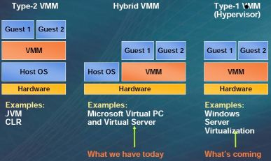

Tech : Virtualisation
=====================

.. contents::

Full Virtualisation
-------------------
also called true, classical, hardware, native, trap-and-emulate, hardware-virtural-machine
Properties of full virtualisation are

*     **Fidelity** - Identical execution as guest or stand-alone. Guest should not be able to tell whether its running in a VM or not.
*     **Performance** - most instructions run at the same speed as native.
*     runs in a hidden segment with own protection, can see all hw state.
*     can run multiple OSes of different versions concurrently
*     recursive hypervisors (nested hypervisors)

hypervisor
----------
hypervisor is like an OS that provides virtual environments.
2 types

#.   Binary Translation - modifies operating system code at run-time.
#.   Para-vitrualisation - operating system code is modified before hand. 

Para-virtualisation
-------------------
This presents a software interface to VMs that is similar but not identical to that of the underlying hardware. What usually happens each OS uses a HAL (hardware abstraction layer) which is ported to use hypervisor as another target architecture. Also supports batching of page-table operations.

Emulators
---------
Usually not hypervisor-based and not usually considered virtualisation. Its a program that emulates entire CPU, motherboard and other peripherals. Sacrifies performance and easy to implement. One of the good known emulators is QEMU, KVM, VirtualBox.

Emulators also do dynamic translation of instructions ( also called Just-in-time compilation). About 4x slow as native.

KQEMU is kernel-mode QEMU. Its a driver that works with QEMU, but does not do binary translation or patching, but executes code directly by arranging to trap-and-emulate privileged code.

XDC
---
supports para-virtualisation guests. Also supports unmodified guests but not hardware architectureus which have virtualisation support built-in.

Domain (Dom0)
-------------
Dom0 is the first doamin started at boot time, it manages all the hardware, and also manages all the other domains. Dom0 is responsible for starting or stopping other domains, responsible for I/O and network traffic. Rest of the domains are called DomU which are called Under-priviliged domain. All these under-priviliged domains use Dom0 to perform any hardware interactions.

Intel Ring Architecture
-----------------------
Intel cpu has levels called Rings. Operating systems usually run in Ring0. Ring0 has special privileged instrucntions that can only be run in Ring0.

Why XDC cannot support unmodified guests in old hardware
--------------------------------------------------------
Hypervisor usually runs in Ring0, so virtual machines run in a lower level ring. So if the guests are not modified they would execute privilege instructions and cause faults.

How IntelVT helps
-----------------
IntelVT allows both the hypervisor and virtual machines to run in Ring0. In Ring0 there are 2 modes

#.   Vmx-root
#.   Vmx-non-root

Hypervisor runts at Vmx-root and guest operating system runs at vmx-nonroot. Now guest operating systems running privilege instrunctions insted of being fauled go into hypervisor through some linkage, which is setup when the hypervrisor starts.

IntelVT has different varieties

#.   Vanderpool
#.   VT-x (virtualisation on x86)
#.   VT-I (virtualisation on Itanium)
#.   VT-d (virtualisation of dma

Intel EPT and AMD NPT ( Extended/Nested Page Tables )
-----------------------------------------------------
hypervisor usually fakes page tables. Instead of hypervisor maintaining another page translation these technologies provide automatinc page translation.

Page sharing
------------
Paravirtualision driver shares pages with guest operating system, so that the network and I/O traffic do not experience any performance problems. The frontend and backend drivers share pages.

OS ABI ( Application Binary Interface ) virtualisation
------------------------------------------------------
Its virtualiation inside a single OS. Each process is provided a virutalised environment in which it can work. The virtualistaion environment would have different filesystem namespaces, devices and other stuff. It provides best performance as native.
Also called namespace-virtualisation os-level virtualisation, kernel-level virtualistaion, virtual environments, os partitioning, partitions, soft-partitions, compartmentalistaion, virtual private servers, light-weight virtualistaion.

Some of the implementations of this virtualistaion are FreeBSD jails, Solaris Containers, Solaris Zones, AIX micro-partitions, HP vPars, Linux VServer, Linuc OpenVZ, Virtuozzo

Application ABI Virtualisation
------------------------------
Since this is at application, it does not require modifying OS. Filter drivers intercept and alter all path specifiers relevant to I/O. Provides different namespaces, different copies of recources.

Some of the implementations are Altiris SVS and Microsoft Softgrid.

Vmware ESX
----------
hypervisor runs on physical machine called vmkernel. Driviers are directly included in the hypervisor, because of which it only supported small list of enterprise class hardware.
Each VM is managed by Virtual Machine Monitor, which monitors the address space of the virtual machine and also just-in-compilations of virtual machine x86 code.
Linux VM called Console OS provides management interface.
ESX 3i puts the hypervisor on flash memory.

Live Migration
--------------
Live Migration allows an application running in an guest OS to be migrated to naother guest on a different physical server with very little downtime ( less than a second ).
During live migration the hypervisor on the first server moves the non-dirty pages on to the other hypervisor, and then tries to move dirty pages. It keeps trying this in a loop until it has very little pages to move, then it would perform the switch. The time delay is the delay in copying the last few pages.
Vmware calls this feature as VMotion.

Microsoft Hyper-V
-----------------
The architecture is similar to Xen. Similar to Xen's Dom0, windows calls it as Parent Partition. It is privileged virtual machine that manages other VMs and contains the drivers for physical devices. All the physical pages are directly get mapped to this VM's pages when required.
Rest of the virtual machines have child partitions (similar to DomU's in Xen).

Viridan
-------

3 components

#.   Hypervisor
#.   Vritualisation Stack
#.   Vritual Devices

**Virtual Machine Monitor (VMM)** virtualises underlying hardware resources

Resource Virtualisaion Techniques

#.   Partitioning
#.   Time Sharing
#.   Emulating

Parents are arranged in a tree, parents manage children. Each parent contains a Virtualisation Stack, manages child's memory, manages virtual devices. In WSV there is only one parent.

Guests communicate with the hypervisor via hypercalls

#.   Hypervisor equivalent of system call
#.   Detected via CpuId
#.   Configured via MSR (Model Specific Register)

The hypervisor schedules cores.

Partitions are the unit of containment, Virtual Machine (VM) refers to the partition and its state.

Guests are software that run in a partition, such as Guest OSa

**Virtual Processors (VP)** correspond to logical processors

**Physical System === Parition**
**Logical Processor === Virtual Processor**

Most guests expect physically contigous memory starting at zero.

#.   Not everybody can start at zero
#.   Contigous memory hard to find after boot

Guest physical Addresses to Host Physical Addresses via 2nd set of page tables (shadow page tables, done in software. Hypervisor maintains internal tables to convert from GPA to HPS (SPA). 

