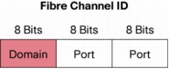

vSAN
====

.. contents::

vSAN
----
In computer networking, a virtual storage area network (VSAN) is a collection of ports from a set of connected Fibre Channel switches, that form a virtual fabric. Ports within a single switch can be partitioned into multiple VSANs, despite sharing hardware resources. Conversely, multiple switches can join a number of ports to form a single VSAN.

A VSAN, like each FC fabric, can offer different high-level protocols such as FCP, FCIP, FICON, iSCSI. Each VSAN is a separate self-contained fabric using distinctive security policies, zones, events, memberships, and name services. Traffic is also separate.

One major concern when designing and building Fibre Channel-based SANs is the total number of switches or domains that can exist in a physical fabric. As the edge switch population grows, the number of domain IDs becomes a concern. The domain is the address of a physical switch or logical virtual fabric; the domain ID is the most significant byte in an endpoint Fibre Channel ID.

The switch uses this Fibre Channel ID to route frames from a given source (initiator) to any destination (target) in a SAN fabric. This 1 byte allows up to 256 possible addresses. The Fibre Channel standard allows for a total of 239 port addresses.

Another design concern is interoperability with third-party switches. In the past, different SAN fabric vendors interpreted the Fibre Channel addressing standard differently. In addition, some vendor-specific attributes used for switch-to-switch connectivity (or expansion port [E-Port] connectivity) made connection of switches from different vendors challenging, leading customers to implement edge switch technology that matched the core director type in the fabric.

N_Port ID Virtualization
------------------------
N_Port ID Virtualization or NPIV is a Fibre Channel facility allowing multiple N_Port IDs to share a single physical N_Port. This allows multiple Fibre Channel initiators to occupy a single physical port, easing hardware requirements in Storage area network design, especially where virtual SANs are called for.

NPIV allows a Fibre Channel host connection or N-Port, to be assigned multiple N-Port IDs or Fibre Channel IDs (FCIDs) over a single link. All FCIDs assigned can now be managed on a Fibre Channel fabric as unique entities on the same physical host. Different applications can be used in conjunction with NPIV. In a virtual machine environment where many host operating systems or applications are running on a physical host, each virtual machine can now be managed independently from zoning, aliasing, and security perspectives.

A host bus adapter (HBA) that supports the NPIV feature follows the standard login process. The initial connection and login to the fabric is performed through the standard F-Port login (FLOGI) process. All subsequent logins for either virtual machines or logical part ions on a mainframe are transformed into FDISC login commands. The FDISC logins follow the same standard process. Figure 3 steps through the login process of an NPIV uplink and the local logins to the NPIV-enabled adapter.

Normally N_Port initialization proceeds like this:

*    N_Port sends FLOGI to address 0xFFFFFE to obtain a valid address
*    N_Port sends PLOGI to address 0xFFFFFC to register this address with the name server
*    N_Port sends SCR to address 0xFFFFFD to register for state change notifications

However with NPIV it may continue like this:

*    N_Port sends FDISC to address 0xFFFFFE to obtain an additional address
*    N_Port sends PLOGI to address 0xFFFFFC to register his additional address with the name server
*    N_Port sends SCR to address 0xFFFFFD to register for state change notifications.
*    ... (repeat FDISC/PLOGI/SCR for next address)

FDISC is abbreviation of "Discover Fabric Service Parameters", which is a misleading name in this context. It works just like FLOGI.

When using NPIV in vSAN environment, each subsequent FDISC login will be a part of the same VSAN as the original fabric login.

N-Port Virtualiser
------------------
An extension to NPIV is the N-Port Virtualizer feature. The N-Port Virtualizer feature allows the blade switch or top-of-rack fabric device to behave as an NPIV-based HBA to the core Fibre Channel director (Figure 4). As end devices log into the NPV-enabled edge switches, the FCID addresses that are assigned use the domain of the core director. Because the connection is treated as an N-Port and not an E-Port to the core director, the edge switch shares the domain ID of the core switch as FCIDs are being allocated. The edge NPV-enabled switch no longer requires a separate domain ID to receive connectivity to the fabric.

F-Port Trunking(Channeling)
---------------------------
Fabric Port (F-Port) Trunking and F-Port Channeling. A PortChannel is the bundling of multiple physical interfaces into one logical high-bandwidth link.

Two new features on the horizon will provide more granular management from an NPV perspective. These are Fabric Port (F-Port) Trunking and F-Port Channeling. A PortChannel is the bundling of multiple physical interfaces into one logical high-bandwidth link. PortChannels provide higher bandwidth, increased link redundancy, and load balancing between two switches. In the Cisco implementation, a port on any module, anywhere on the switch, can be a part of a PortChannel. Route table changes due to a single link failure in the PortChannel interface are unaffected.

The Cisco virtual fabric implementation states that a single F-Port can be a part of one, and only one, VSAN at any given time. An interswitch link (ISL) that is configured in trunk mode, however, can carry multiple VSANs across a single ISL or PortChannel and still keep fabric separation between VSANs. One of the drawbacks of configuring edge devices in NPV mode is that because the link between switches is configured to log in to the fabric as an F-Port, the F-Port uplink can be configured to be in only a single VSAN and carry only a single VSAN across its link. The NPV device can be configured with multiple uplinks, and each can be placed in a different VSAN. The hosts on the NPV device can then be placed in one of those VSANs, and the hosts will log through the appropriate NP uplink port.

F-Port Trunking will allow a single F-Port to participate in multiple VSANs and follow the trunking protocol that Cisco currently has across an ISL. This feature will allow the consolidation of uplinks ports necessary for extending VSAN connectivity to the NP device. Figure 6 shows the connection and how the network will look with F-Port Trunking enabled.

Enabling F-Port Trunking allows any blade server connectivity over any NP uplink across which the VSAN is trunked. This feature can be extended to HBA connections when the HBA vendors enable VSAN trunking within their firmware. F-Port Trunking can enable virtual machines on physical servers to log in and participate in separate VSANs per application or line of business.
The other significant feature on the horizon is F-Port Channeling (Figure 7). As described earlier, when a host logs in to the local switch, its FDISC message is load balanced in a round-robin fashion. Should the link on which the host has its session fail, the host would have to log in again to the fabric, restarting the login process. N-Port uplinks from the NPV device cannot be bundled to take advantage of any type of high availability.

F-Port Channeling will allow the same type of resiliency and availability between switches as an ISL PortChannel has today. In this configuration, multiple NP uplink ports can be bundled or channeled together to form a single logical link. Should a single link in the channel fail, the data frames crossing that single link would be lost, and typical application and network error recovery would take place.

The other concern that F-Port Channeling resolves also relates to link failures. With F-Port Channeling configured, when a link that originally carried the login process from the edge NPV device to the core fails, the host is no longer required to perform a full login again to the fabric. The login state remains intact even though the link has failed. As long as a single link in the channel is operational, the host does not go through the login process

In a F-Port Port-Channel logical link, if a single link fails in the channel, the host no longer has to login again to the fabric to get connectivity. The host will remain logged in; the data flow that was on the link that failed will need to go through recovery mode, but the host will stay logged into the network. Data traffic will also be load balanced on a src/dst hash or src/dst/oxid hash to send traffic down the bundled uplinks. This feature removes the need to perform manual load balancing again across NP uplinks during a failure and recovery period.

